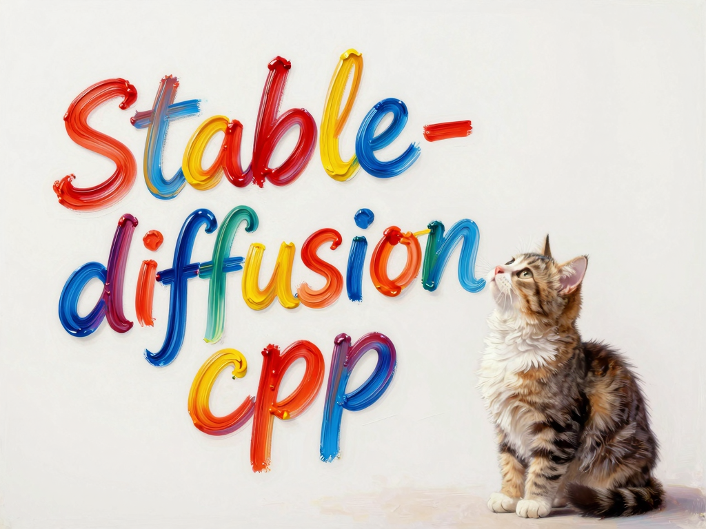

<p align="center">
  
</p>

# stable-diffusion.cpp

<div align="center">
<a href="https://trendshift.io/repositories/9714" target="_blank"></a>
</div>

Diffusion model(SD,Flux,Wan,...) inference in pure C/C++

***Note that this project is under active development. \
API and command-line option may change frequently.***

## 🔥Important News

* **2025/12/01** 🚀 stable-diffusion.cpp now supports **Z-Image**  
  👉 Details: [PR #1020](https://github.com/leejet/stable-diffusion.cpp/pull/1020)

* **2025/11/30** 🚀 stable-diffusion.cpp now supports **FLUX.2-dev**  
  👉 Details: [PR #1016](https://github.com/leejet/stable-diffusion.cpp/pull/1016)

* **2025/10/13** 🚀 stable-diffusion.cpp now supports **Qwen-Image-Edit / Qwen-Image-Edit 2509**  
  👉 Details: [PR #877](https://github.com/leejet/stable-diffusion.cpp/pull/877)

* **2025/10/12** 🚀 stable-diffusion.cpp now supports **Qwen-Image**  
  👉 Details: [PR #851](https://github.com/leejet/stable-diffusion.cpp/pull/851)

* **2025/09/14** 🚀 stable-diffusion.cpp now supports **Wan2.1 Vace**  
  👉 Details: [PR #819](https://github.com/leejet/stable-diffusion.cpp/pull/819)

* **2025/09/06** 🚀 stable-diffusion.cpp now supports **Wan2.1 / Wan2.2**  
  👉 Details: [PR #778](https://github.com/leejet/stable-diffusion.cpp/pull/778)

## Features

- Plain C/C++ implementation based on [ggml](https://github.com/ggml-org/ggml), working in the same way as [llama.cpp](https://github.com/ggml-org/llama.cpp)
- Super lightweight and without external dependencies
- Supported models
  - Image Models
    - SD1.x, SD2.x, [SD-Turbo](https://huggingface.co/stabilityai/sd-turbo)
    - SDXL, [SDXL-Turbo](https://huggingface.co/stabilityai/sdxl-turbo)
    - [Some SD1.x and SDXL distilled models](./docs/distilled_sd.md)
    - [SD3/SD3.5](./docs/sd3.md)
    - [FlUX.1-dev/FlUX.1-schnell](./docs/flux.md)
    - [FLUX.2-dev](./docs/flux2.md)
    - [Chroma](./docs/chroma.md)
    - [Chroma1-Radiance](./docs/chroma_radiance.md)
    - [Qwen Image](./docs/qwen_image.md)
    - [Z-Image](./docs/z_image.md)
    - [Ovis-Image](./docs/ovis_image.md)
  - Image Edit Models
    - [FLUX.1-Kontext-dev](./docs/kontext.md)
    - [Qwen Image Edit series](./docs/qwen_image_edit.md)
  - Video Models
    - [Wan2.1/Wan2.2](./docs/wan.md)
  - [PhotoMaker](https://github.com/TencentARC/PhotoMaker) support.
  - Control Net support with SD 1.5
  - LoRA support, same as [stable-diffusion-webui](https://github.com/AUTOMATIC1111/stable-diffusion-webui/wiki/Features#lora)
  - Latent Consistency Models support (LCM/LCM-LoRA)
  - Faster and memory efficient latent decoding with [TAESD](https://github.com/madebyollin/taesd)
  - Upscale images generated with [ESRGAN](https://github.com/xinntao/Real-ESRGAN)
- Supported backends
  - CPU (AVX, AVX2 and AVX512 support for x86 architectures)
  - CUDA
  - Vulkan
  - Metal
  - OpenCL
  - SYCL
- Supported weight formats
  - Pytorch checkpoint (`.ckpt` or `.pth`)
  - Safetensors (`.safetensors`)
  - GGUF (`.gguf`)
- Supported platforms
    - Linux
    - Mac OS
    - Windows
    - Android (via Termux, [Local Diffusion](https://github.com/rmatif/Local-Diffusion))
- Flash Attention for memory usage optimization
- Negative prompt
- [stable-diffusion-webui](https://github.com/AUTOMATIC1111/stable-diffusion-webui) style tokenizer (not all the features, only token weighting for now)
- VAE tiling processing for reduce memory usage
- Sampling method
    - `Euler A`
    - `Euler`
    - `Heun`
    - `DPM2`
    - `DPM++ 2M`
    - [`DPM++ 2M v2`](https://github.com/AUTOMATIC1111/stable-diffusion-webui/discussions/8457)
    - `DPM++ 2S a`
    - [`LCM`](https://github.com/AUTOMATIC1111/stable-diffusion-webui/issues/13952)
- Cross-platform reproducibility
    - `--rng cuda`, default, consistent with the `stable-diffusion-webui GPU RNG`
    - `--rng cpu`, consistent with the `comfyui RNG`
- Embedds generation parameters into png output as webui-compatible text string

## Quick Start

### Get the sd executable

- Download pre-built binaries from the [releases page](https://github.com/leejet/stable-diffusion.cpp/releases)
- Or build from source by following the [build guide](./docs/build.md)

### Download model weights

- download weights(.ckpt or .safetensors or .gguf). For example
    - Stable Diffusion v1.5 from https://huggingface.co/stable-diffusion-v1-5/stable-diffusion-v1-5 

    ```sh
    curl -L -O https://huggingface.co/runwayml/stable-diffusion-v1-5/resolve/main/v1-5-pruned-emaonly.safetensors
    ```

### Generate an image with just one command

```sh
./bin/sd-cli -m ../models/v1-5-pruned-emaonly.safetensors -p "a lovely cat"
```

***For detailed command-line arguments, check out [cli doc](./examples/cli/README.md).***

## Performance

If you want to improve performance or reduce VRAM/RAM usage, please refer to [performance guide](./docs/performance.md).

## More Guides

- [SD1.x/SD2.x/SDXL](./docs/sd.md)
- [SD3/SD3.5](./docs/sd3.md)
- [FlUX.1-dev/FlUX.1-schnell](./docs/flux.md)
- [FLUX.2-dev](./docs/flux2.md)
- [FLUX.1-Kontext-dev](./docs/kontext.md)
- [Chroma](./docs/chroma.md)
- [🔥Qwen Image](./docs/qwen_image.md)
- [🔥Qwen Image Edit series](./docs/qwen_image_edit.md)
- [🔥Wan2.1/Wan2.2](./docs/wan.md)
- [🔥Z-Image](./docs/z_image.md)
- [Ovis-Image](./docs/ovis_image.md)
- [LoRA](./docs/lora.md)
- [LCM/LCM-LoRA](./docs/lcm.md)
- [Using PhotoMaker to personalize image generation](./docs/photo_maker.md)
- [Using ESRGAN to upscale results](./docs/esrgan.md)
- [Using TAESD to faster decoding](./docs/taesd.md)
- [Docker](./docs/docker.md)
- [Quantization and GGUF](./docs/quantization_and_gguf.md)
- [Inference acceleration via caching](./docs/caching.md)

## Bindings

These projects wrap `stable-diffusion.cpp` for easier use in other languages/frameworks.

* Golang (non-cgo): [seasonjs/stable-diffusion](https://github.com/seasonjs/stable-diffusion)
* Golang (cgo): [Binozo/GoStableDiffusion](https://github.com/Binozo/GoStableDiffusion)
* C#: [DarthAffe/StableDiffusion.NET](https://github.com/DarthAffe/StableDiffusion.NET)
* Python: [william-murray1204/stable-diffusion-cpp-python](https://github.com/william-murray1204/stable-diffusion-cpp-python)
* Rust: [newfla/diffusion-rs](https://github.com/newfla/diffusion-rs)
* Flutter/Dart: [rmatif/Local-Diffusion](https://github.com/rmatif/Local-Diffusion)

## UIs

These projects use `stable-diffusion.cpp` as a backend for their image generation.

- [Jellybox](https://jellybox.com)
- [Stable Diffusion GUI](https://github.com/fszontagh/sd.cpp.gui.wx)
- [Stable Diffusion CLI-GUI](https://github.com/piallai/stable-diffusion.cpp)
- [Local Diffusion](https://github.com/rmatif/Local-Diffusion)
- [sd.cpp-webui](https://github.com/daniandtheweb/sd.cpp-webui)
- [LocalAI](https://github.com/mudler/LocalAI)
- [Neural-Pixel](https://github.com/Luiz-Alcantara/Neural-Pixel)
- [KoboldCpp](https://github.com/LostRuins/koboldcpp)

## Contributors

Thank you to all the people who have already contributed to stable-diffusion.cpp!

[](https://github.com/leejet/stable-diffusion.cpp/graphs/contributors)

## Star History

[](https://star-history.com/#leejet/stable-diffusion.cpp&Date)

## References

- [ggml](https://github.com/ggml-org/ggml)
- [diffusers](https://github.com/huggingface/diffusers)
- [stable-diffusion](https://github.com/CompVis/stable-diffusion)
- [sd3-ref](https://github.com/Stability-AI/sd3-ref)
- [stable-diffusion-stability-ai](https://github.com/Stability-AI/stablediffusion)
- [stable-diffusion-webui](https://github.com/AUTOMATIC1111/stable-diffusion-webui)
- [ComfyUI](https://github.com/comfyanonymous/ComfyUI)
- [k-diffusion](https://github.com/crowsonkb/k-diffusion)
- [latent-consistency-model](https://github.com/luosiallen/latent-consistency-model)
- [generative-models](https://github.com/Stability-AI/generative-models/)
- [PhotoMaker](https://github.com/TencentARC/PhotoMaker)
- [Wan2.1](https://github.com/Wan-Video/Wan2.1)
- [Wan2.2](https://github.com/Wan-Video/Wan2.2)
