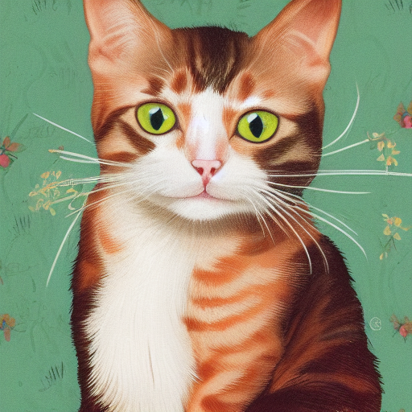
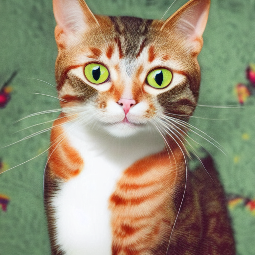
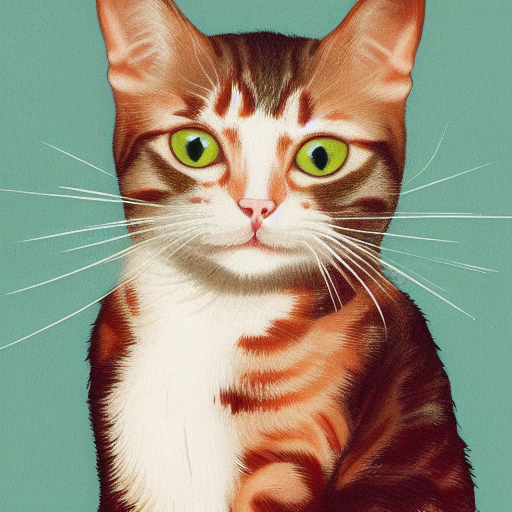
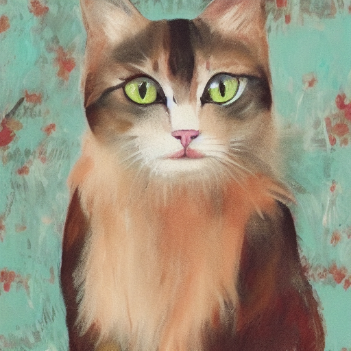
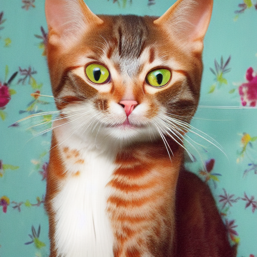
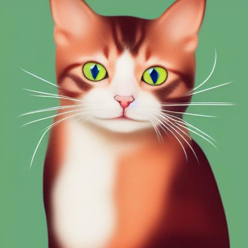
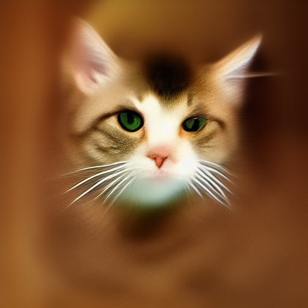
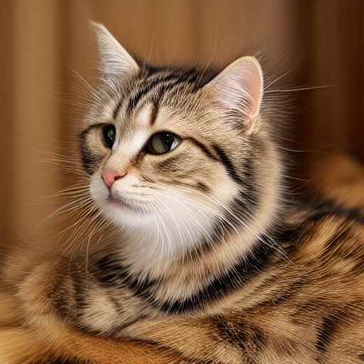

<p align="center">
  
</p>

# stable-diffusion.cpp

Inference of [Stable Diffusion](https://github.com/CompVis/stable-diffusion) in pure C/C++

## Features

- Plain C/C++ implementation based on [ggml](https://github.com/ggerganov/ggml), working in the same way as [llama.cpp](https://github.com/ggerganov/llama.cpp)
- Super lightweight and without external dependencies
- SD1.x, SD2.x and SDXL support
    - !!!The VAE in SDXL encounters NaN issues under FP16, but unfortunately, the ggml_conv_2d only operates under FP16. Hence, a parameter is needed to specify the VAE that has fixed the FP16 NaN issue. You can find it here: [SDXL VAE FP16 Fix](https://huggingface.co/madebyollin/sdxl-vae-fp16-fix/blob/main/sdxl_vae.safetensors).

- [SD-Turbo](https://huggingface.co/stabilityai/sd-turbo) and [SDXL-Turbo](https://huggingface.co/stabilityai/sdxl-turbo) support
- [PhotoMaker](https://github.com/TencentARC/PhotoMaker) support.
- 16-bit, 32-bit float support
- 4-bit, 5-bit and 8-bit integer quantization support
- Accelerated memory-efficient CPU inference
    - Only requires ~2.3GB when using txt2img with fp16 precision to generate a 512x512 image, enabling Flash Attention just requires ~1.8GB.
- AVX, AVX2 and AVX512 support for x86 architectures
- Full CUDA and Metal backend for GPU acceleration.
- Can load ckpt, safetensors and diffusers models/checkpoints. Standalone VAEs models
    - No need to convert to `.ggml` or `.gguf` anymore!
- Flash Attention for memory usage optimization (only cpu for now)
- Original `txt2img` and `img2img` mode
- Negative prompt
- [stable-diffusion-webui](https://github.com/AUTOMATIC1111/stable-diffusion-webui) style tokenizer (not all the features, only token weighting for now)
- LoRA support, same as [stable-diffusion-webui](https://github.com/AUTOMATIC1111/stable-diffusion-webui/wiki/Features#lora)
- Latent Consistency Models support (LCM/LCM-LoRA)
- Faster and memory efficient latent decoding with [TAESD](https://github.com/madebyollin/taesd)
- Upscale images generated with [ESRGAN](https://github.com/xinntao/Real-ESRGAN)
- VAE tiling processing for reduce memory usage
- Control Net support with SD 1.5
- Sampling method
    - `Euler A`
    - `Euler`
    - `Heun`
    - `DPM2`
    - `DPM++ 2M`
    - [`DPM++ 2M v2`](https://github.com/AUTOMATIC1111/stable-diffusion-webui/discussions/8457)
    - `DPM++ 2S a`
    - [`LCM`](https://github.com/AUTOMATIC1111/stable-diffusion-webui/issues/13952)
- Cross-platform reproducibility (`--rng cuda`, consistent with the `stable-diffusion-webui GPU RNG`)
- Embedds generation parameters into png output as webui-compatible text string
- Supported platforms
    - Linux
    - Mac OS
    - Windows
    - Android (via Termux)

### TODO

- [ ] More sampling methods
- [ ] Make inference faster
    - The current implementation of ggml_conv_2d is slow and has high memory usage
- [ ] Continuing to reduce memory usage (quantizing the weights of ggml_conv_2d)
- [ ] Implement Inpainting support
- [ ] k-quants support

## Usage

For most users, you can download the built executable program from the latest [release](https://github.com/leejet/stable-diffusion.cpp/releases/latest).
If the built product does not meet your requirements, you can choose to build it manually.

### Get the Code

```
git clone --recursive https://github.com/leejet/stable-diffusion.cpp
cd stable-diffusion.cpp
```

- If you have already cloned the repository, you can use the following command to update the repository to the latest code.

```
cd stable-diffusion.cpp
git pull origin master
git submodule init
git submodule update
```

### Download weights

- download original weights(.ckpt or .safetensors). For example
    - Stable Diffusion v1.4 from https://huggingface.co/CompVis/stable-diffusion-v-1-4-original
    - Stable Diffusion v1.5 from https://huggingface.co/runwayml/stable-diffusion-v1-5
    - Stable Diffuison v2.1 from https://huggingface.co/stabilityai/stable-diffusion-2-1

    ```shell
    curl -L -O https://huggingface.co/CompVis/stable-diffusion-v-1-4-original/resolve/main/sd-v1-4.ckpt
    # curl -L -O https://huggingface.co/runwayml/stable-diffusion-v1-5/resolve/main/v1-5-pruned-emaonly.safetensors
    # curl -L -O https://huggingface.co/stabilityai/stable-diffusion-2-1/resolve/main/v2-1_768-nonema-pruned.safetensors
    ```

### Build

#### Build from scratch

```shell
mkdir build
cd build
cmake ..
cmake --build . --config Release
```

##### Using OpenBLAS

```
cmake .. -DGGML_OPENBLAS=ON
cmake --build . --config Release
```

##### Using CUBLAS

This provides BLAS acceleration using the CUDA cores of your Nvidia GPU. Make sure to have the CUDA toolkit installed. You can download it from your Linux distro's package manager (e.g. `apt install nvidia-cuda-toolkit`) or from here: [CUDA Toolkit](https://developer.nvidia.com/cuda-downloads). Recommended to have at least 4 GB of VRAM.

```
cmake .. -DSD_CUBLAS=ON
cmake --build . --config Release
```

##### Using HipBLAS
This provides BLAS acceleration using the ROCm cores of your AMD GPU. Make sure to have the ROCm toolkit installed.

Windows User Refer to [docs/hipBLAS_on_Windows.md](docs%2FhipBLAS_on_Windows.md) for a comprehensive guide.

```
cmake .. -G "Ninja" -DCMAKE_C_COMPILER=clang -DCMAKE_CXX_COMPILER=clang++ -DSD_HIPBLAS=ON -DCMAKE_BUILD_TYPE=Release -DAMDGPU_TARGETS=gfx1100
cmake --build . --config Release
```


##### Using Metal

Using Metal makes the computation run on the GPU. Currently, there are some issues with Metal when performing operations on very large matrices, making it highly inefficient at the moment. Performance improvements are expected in the near future.

```
cmake .. -DSD_METAL=ON
cmake --build . --config Release
```

##### Using Flash Attention

Enabling flash attention reduces memory usage by at least 400 MB. At the moment, it is not supported when CUBLAS is enabled because the kernel implementation is missing.

```
cmake .. -DSD_FLASH_ATTN=ON
cmake --build . --config Release
```

### Run

```
usage: ./bin/sd [arguments]

arguments:
  -h, --help                         show this help message and exit
  -M, --mode [MODEL]                 run mode (txt2img or img2img or convert, default: txt2img)
  -t, --threads N                    number of threads to use during computation (default: -1).
                                     If threads <= 0, then threads will be set to the number of CPU physical cores
  -m, --model [MODEL]                path to model
  --vae [VAE]                        path to vae
  --taesd [TAESD_PATH]               path to taesd. Using Tiny AutoEncoder for fast decoding (low quality)
  --control-net [CONTROL_PATH]       path to control net model
  --embd-dir [EMBEDDING_PATH]        path to embeddings.
  --stacked-id-embd-dir [DIR]        path to PHOTOMAKER stacked id embeddings.
  --input-id-images-dir [DIR]        path to PHOTOMAKER input id images dir.
  --normalize-input                  normalize PHOTOMAKER input id images
  --upscale-model [ESRGAN_PATH]      path to esrgan model. Upscale images after generate, just RealESRGAN_x4plus_anime_6B supported by now.
  --upscale-repeats                  Run the ESRGAN upscaler this many times (default 1)
  --type [TYPE]                      weight type (f32, f16, q4_0, q4_1, q5_0, q5_1, q8_0)
                                     If not specified, the default is the type of the weight file.
  --lora-model-dir [DIR]             lora model directory
  -i, --init-img [IMAGE]             path to the input image, required by img2img
  --control-image [IMAGE]            path to image condition, control net
  -o, --output OUTPUT                path to write result image to (default: ./output.png)
  -p, --prompt [PROMPT]              the prompt to render
  -n, --negative-prompt PROMPT       the negative prompt (default: "")
  --cfg-scale SCALE                  unconditional guidance scale: (default: 7.0)
  --strength STRENGTH                strength for noising/unnoising (default: 0.75)
  --style-ratio STYLE-RATIO          strength for keeping input identity (default: 20%)
  --control-strength STRENGTH        strength to apply Control Net (default: 0.9)
                                     1.0 corresponds to full destruction of information in init image
  -H, --height H                     image height, in pixel space (default: 512)
  -W, --width W                      image width, in pixel space (default: 512)
  --sampling-method {euler, euler_a, heun, dpm2, dpm++2s_a, dpm++2m, dpm++2mv2, lcm}
                                     sampling method (default: "euler_a")
  --steps  STEPS                     number of sample steps (default: 20)
  --rng {std_default, cuda}          RNG (default: cuda)
  -s SEED, --seed SEED               RNG seed (default: 42, use random seed for < 0)
  -b, --batch-count COUNT            number of images to generate.
  --schedule {discrete, karras}      Denoiser sigma schedule (default: discrete)
  --clip-skip N                      ignore last layers of CLIP network; 1 ignores none, 2 ignores one layer (default: -1)
                                     <= 0 represents unspecified, will be 1 for SD1.x, 2 for SD2.x
  --vae-tiling                       process vae in tiles to reduce memory usage
  --control-net-cpu                  keep controlnet in cpu (for low vram)
  --canny                            apply canny preprocessor (edge detection)
  -v, --verbose                      print extra info
```

#### Quantization

You can specify the model weight type using the `--type` parameter. The weights are automatically converted when loading the model.

- `f16` for 16-bit floating-point
- `f32` for 32-bit floating-point
- `q8_0` for 8-bit integer quantization
- `q5_0` or `q5_1` for 5-bit integer quantization
- `q4_0` or `q4_1` for 4-bit integer quantization

#### Convert to GGUF

You can also convert weights in the formats `ckpt/safetensors/diffusers` to gguf and perform quantization in advance, avoiding the need for quantization every time you load them.

For example:

```sh
./bin/sd -M convert -m ../models/v1-5-pruned-emaonly.safetensors -o  ../models/v1-5-pruned-emaonly.q8_0.gguf -v --type q8_0
```

#### txt2img example

```sh
./bin/sd -m ../models/sd-v1-4.ckpt -p "a lovely cat"
# ./bin/sd -m ../models/v1-5-pruned-emaonly.safetensors -p "a lovely cat"
# ./bin/sd -m ../models/sd_xl_base_1.0.safetensors --vae ../models/sdxl_vae-fp16-fix.safetensors -H 1024 -W 1024 -p "a lovely cat" -v
```

Using formats of different precisions will yield results of varying quality.

| f32  | f16  |q8_0  |q5_0  |q5_1  |q4_0  |q4_1  |
| ----  |----  |----  |----  |----  |----  |----  |
|  | | | | | | |

#### img2img example

- `./output.png` is the image generated from the above txt2img pipeline


```
./bin/sd --mode img2img -m ../models/sd-v1-4.ckpt -p "cat with blue eyes" -i ./output.png -o ./img2img_output.png --strength 0.4
```

<p align="center">
  
</p>

#### with LoRA

- You can specify the directory where the lora weights are stored via `--lora-model-dir`. If not specified, the default is the current working directory.

- LoRA is specified via prompt, just like [stable-diffusion-webui](https://github.com/AUTOMATIC1111/stable-diffusion-webui/wiki/Features#lora).

Here's a simple example:

```
./bin/sd -m ../models/v1-5-pruned-emaonly.safetensors -p "a lovely cat<lora:marblesh:1>" --lora-model-dir ../models
```

`../models/marblesh.safetensors` or `../models/marblesh.ckpt` will be applied to the model

#### LCM/LCM-LoRA

- Download LCM-LoRA form https://huggingface.co/latent-consistency/lcm-lora-sdv1-5
- Specify LCM-LoRA by adding `<lora:lcm-lora-sdv1-5:1>` to prompt
- It's advisable to set `--cfg-scale` to `1.0` instead of the default `7.0`. For `--steps`, a range of `2-8` steps is recommended. For `--sampling-method`, `lcm`/`euler_a` is recommended.

Here's a simple example:

```
./bin/sd -m ../models/v1-5-pruned-emaonly.safetensors -p "a lovely cat<lora:lcm-lora-sdv1-5:1>" --steps 4 --lora-model-dir ../models -v --cfg-scale 1
```

| without LCM-LoRA (--cfg-scale 7)  | with LCM-LoRA (--cfg-scale 1)  |
| ----  |----    |
|  |  |

#### Using TAESD to faster decoding

You can use TAESD to accelerate the decoding of latent images by following these steps:

- Download the model [weights](https://huggingface.co/madebyollin/taesd/blob/main/diffusion_pytorch_model.safetensors).

Or curl

```bash
curl -L -O https://huggingface.co/madebyollin/taesd/blob/main/diffusion_pytorch_model.safetensors
```

- Specify the model path using the `--taesd PATH` parameter. example:

```bash
sd -m ../models/v1-5-pruned-emaonly.safetensors -p "a lovely cat" --taesd ../models/diffusion_pytorch_model.safetensors
```

#### Using ESRGAN to upscale results

You can use ESRGAN to upscale the generated images. At the moment, only the [RealESRGAN_x4plus_anime_6B.pth](https://github.com/xinntao/Real-ESRGAN/releases/download/v0.2.2.4/RealESRGAN_x4plus_anime_6B.pth) model is supported. Support for more models of this architecture will be added soon.

- Specify the model path using the `--upscale-model PATH` parameter. example:

```bash
sd -m ../models/v1-5-pruned-emaonly.safetensors -p "a lovely cat" --upscale-model ../models/RealESRGAN_x4plus_anime_6B.pth
```

#### Using PhotoMaker to personalize image generation

You can use [PhotoMaker](https://github.com/TencentARC/PhotoMaker) to personalize generated images with your own ID.

**NOTE**, currently PhotoMaker **ONLY** works with **SDXL** (any SDXL model files will work).

Download PhotoMaker model file (in safetensor format) [here](https://huggingface.co/bssrdf/PhotoMaker). The official release of the model file (in .bin format) does not work with ```stablediffusion.cpp```.

- Specify the PhotoMaker model path using the `--stacked-id-embd-dir PATH` parameter.
- Specify the input images path using the `--input-id-images-dir PATH` parameter.
  - input images **must** have the same width and height for preprocessing (to be improved)

In prompt, make sure you have a class word followed by the trigger word ```"img"``` (hard-coded for now). The class word could be one of ```"man, woman, girl, boy"```. If input ID images contain asian faces, add ```Asian``` before the class
word.

Another PhotoMaker specific parameter:

- ```--style-ratio  (0-100)%```: default is 20 and 10-20 typically gets good results. Lower ratio means more faithfully following input ID (not necessarily better quality).

Other parameters recommended for running Photomaker:

- ```--cfg-scale 5.0```
- ```-H 1024```
- ```-W 1024```

If on low memory GPUs (<= 8GB), recommend running with ```--vae-on-cpu``` option to get artifact free images.

Example:

```bash
bin/sd -m ../models/sdxlUnstableDiffusers_v11.safetensors  --vae ../models/sdxl_vae.safetensors --stacked-id-embd-dir ../models/photomaker-v1.safetensors --input-id-images-dir ../assets/examples/scarletthead_woman -p "a girl img, retro futurism, retro game art style but extremely beautiful, intricate details, masterpiece, best quality, space-themed, cosmic, celestial, stars, galaxies, nebulas, planets, science fiction, highly detailed" -n "realistic, photo-realistic, worst quality, greyscale, bad anatomy, bad hands, error, text" --cfg-scale 5.0  --sampling-method euler -H 1024 -W 1024 --style-ratio 10 --vae-on-cpu -o output.png
```

### Docker

#### Building using Docker

```shell
docker build -t sd .
```

#### Run

```shell
docker run -v /path/to/models:/models -v /path/to/output/:/output sd [args...]
# For example
# docker run -v ./models:/models -v ./build:/output sd -m /models/sd-v1-4.ckpt -p "a lovely cat" -v -o /output/output.png
```

## Memory Requirements

| precision | f32  | f16  |q8_0  |q5_0  |q5_1  |q4_0  |q4_1  |
| ----         | ----  |----  |----  |----  |----  |----  |----  |
|  **Memory** (txt2img - 512 x 512) | ~2.8G | ~2.3G | ~2.1G | ~2.0G | ~2.0G | ~2.0G | ~2.0G |
|  **Memory** (txt2img - 512 x 512) *with Flash Attention* | ~2.4G | ~1.9G | ~1.6G | ~1.5G | ~1.5G | ~1.5G | ~1.5G |

## Bindings

These projects wrap `stable-diffusion.cpp` for easier use in other languages/frameworks.

* Golang: [seasonjs/stable-diffusion](https://github.com/seasonjs/stable-diffusion)
* C#: [DarthAffe/StableDiffusion.NET](https://github.com/DarthAffe/StableDiffusion.NET)

## UIs

These projects use `stable-diffusion.cpp` as a backend for their image generation.

- [Jellybox](https://jellybox.com)

## Contributors

Thank you to all the people who have already contributed to stable-diffusion.cpp!

[](https://github.com/leejet/stable-diffusion.cpp/graphs/contributors)

## References

- [ggml](https://github.com/ggerganov/ggml)
- [stable-diffusion](https://github.com/CompVis/stable-diffusion)
- [stable-diffusion-stability-ai](https://github.com/Stability-AI/stablediffusion)
- [stable-diffusion-webui](https://github.com/AUTOMATIC1111/stable-diffusion-webui)
- [ComfyUI](https://github.com/comfyanonymous/ComfyUI)
- [k-diffusion](https://github.com/crowsonkb/k-diffusion)
- [latent-consistency-model](https://github.com/luosiallen/latent-consistency-model)
- [generative-models](https://github.com/Stability-AI/generative-models/)
- [PhotoMaker](https://github.com/TencentARC/PhotoMaker)
