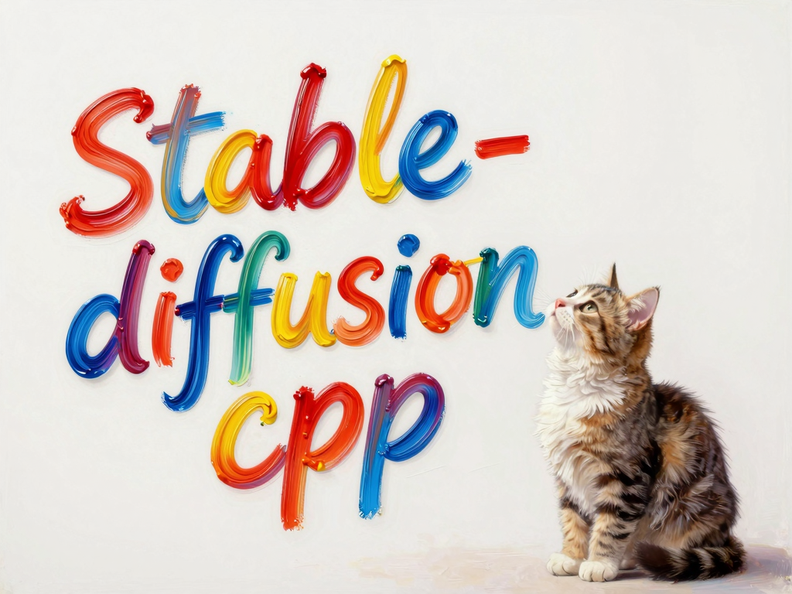

<p align="center">
  
</p>

# Cacheable stable-diffusion.cpp (Fork for Streaming API)

**Diffusion model (SD, Flux, Wan, ...) inference in pure C/C++**

This repository is a fork of [leejet/stable-diffusion.cpp](https://github.com/leejet/stable-diffusion.cpp), modified to introduce a **Condition Caching (Streaming API)**.
While the upstream repo excels at stateless generation, this fork is specifically enhanced for **real-time video generation** and **high-throughput img2img streaming applications** where heavy text encoder re-evaluations (e.g., Qwen/LLM for Flux.2) become devastating bottlenecks.

By leveraging this fork's C API extensions, you can cache prompt conditions and reference images, skipping the LLM layers entirely on subsequent frames.

---

## 🚀 Fork-Specific Features (What's New?)

This repository introduces several major enhancements compared to the upstream implementation, specifically targeting high-performance streaming and advanced denoising optimization.

### 1. Condition Caching (Streaming API)
**The primary feature of this fork.** It separates the expensive preparation phases (Text Encoding & Reference Image Encoding) from the hot-loop diffusion phase.
- **Goal:** Real-time Video-to-Video and high-FPS `img2img`.
- **Key Functions:** `sd_encode_condition()`, `sd_encode_ref_image()`, `sd_img2img_with_cond()`.
- **Memory Safety:** Includes dedicated FFI cleanup functions (`sd_free_image_data`, `sd_free_images`) for robust integration with Rust/Python across DLL boundaries.
- 📘 **[Streaming API Design & Architecture](./docs/streaming_api_design.md)**
- 📘 **[Streaming C API Reference](./docs/c_api_reference.md)**

### 2. Advanced Denoising Caching (Spectrum, DBCache, etc.)
We have implemented several state-of-the-art caching algorithms that skip or predict UNet/DiT forward passes when the latent changes are small.
- **Algorithms:** Spectrum (Chebyshev forecasting), DBCache (Block-level skipping), TaylorSeer, UCache, and EasyCache.
- **Performance:** Can reduce inference time by 20%–50% with minimal quality loss.
- 📘 **[Denoising Caching Guide](./docs/caching.md)**

### 3. Extended Model Support & Optimizations
Support for cutting-edge architectures and specific optimizations not found in the baseline repo.
- **[Wan 2.1 / 2.2](./docs/wan.md)**: High-quality video and image generation.
- **[Flux.1 / Flux.2](./docs/flux2.md)**: Optimized DiT paths.
- **[Chroma / Radiance](./docs/chroma.md)**: Specialized color and lighting models.
- **[PhotoMaker](./docs/photo_maker.md)**: Identity-preserving personalization.

### 4. Specialized CI & Packaging (Rust/FFI Friendly)
The GitHub Actions workflows have been enhanced to satisfy the requirements of downstream FFI consumers (like the Rust wrapper `cacheable-sd-rs`).
- **Windows Artifacts:** In addition to the DLL, the CI now automatically packages the `stable-diffusion.lib` (import library). This is essential for linking the library correctly when using MSVC or Rust on Windows.
- **CI Robustness:** Workflows have been refined to ensure binary artifacts are correctly bundled across CUDA, Vulkan, and CPU backends.
- 📘 **[CI Packaging Diff Memo](./.github/workflows/build-packaging-diff.md)**

---

## 📚 Documentation Index

Detailed guides for various components of the library:

| Category | Document | Description |
| :--- | :--- | :--- |
| **Core API** | [C API Reference](./docs/c_api_reference.md) | Standard and Streaming API usage. |
| **CLI** | [CLI Reference](./docs/cli_reference.md) | Complete guide for the `sd-cli` tool. |
| **Setup** | [Build Guide](./docs/build.md) | Compiling with CUDA, Vulkan, Metal, etc. |
| **Internal** | [Streaming API Design](./docs/streaming_api_design.md) | Deep dive into GGML context management. |
| **Advanced** | [Caching Guide](./docs/caching.md) | Accelerating inference via Spectrum/DBCache. |
| **Models** | [Wan](./docs/wan.md), [Flux.1/2](./docs/flux2.md), [SD3](./docs/sd3.md) | High-end model parameters and usage. |
| **Specialized** | [PhotoMaker](./docs/photo_maker.md), [Chroma](./docs/chroma.md), [Anima](./docs/anima.md) | Identity, color science, and animation extensions. |
| **VLM/VIV** | [Qwen-Image](./docs/qwen_image.md), [Z-Image](./docs/z_image.md) | Visual understanding and editing tools. |
| **Tuning** | [Performance](./docs/performance.md) | Tips for speed and VRAM management. |


---

## Upstream Features

This fork retains 100% compatibility with all the amazing features developed by the original `stable-diffusion.cpp` contributors:

- Plain C/C++ implementation based on [ggml](https://github.com/ggml-org/ggml), working similarly to llama.cpp.
- Super lightweight and without external dependencies.
- **Supported Models**: SD1.x, SD2.x, SDXL, SD3, FLUX.1/FLUX.2, Qwen-Image, Z-Image, Wan2.1/2.2, PhotoMaker, and more.
- **Supported Backends**: CPU (AVX2/AVX512), CUDA, Vulkan, Metal, OpenCL, SYCL.
- **Supported Formats**: Pytorch checkpoints (`.ckpt`/`.pth`), Safetensors (`.safetensors`), GGUF (`.gguf`).
- Flash Attention for aggressive memory usage optimization.
- LoRA support, ControlNet, LCM, ESRGAN upscaling, and TAESD faster latent decoding.

## Quick Start

### 1. Build from Source

Since you will likely integrate this as a backend for another project, we recommend building from source. For full instructions, see the upstream [Build Guide](./docs/build.md).

```sh
# Example: Building with Vulkan acceleration and Shared Libraries (C API)
mkdir build && cd build
cmake .. -DSD_VULKAN=ON -DSD_BUILD_SHARED_LIBS=ON
cmake --build . --config Release
# After a successful build, the CLI binary is at: build/bin/sd-cli
# The shared library is at: build/stable-diffusion.dll (Windows) or build/libstable-diffusion.so (Linux)
```

### 2. Standard CLI Usage

Download a core model file (e.g., `v1-5-pruned-emaonly.safetensors` from Hugging Face).

```sh
./bin/sd-cli -m ../models/v1-5-pruned-emaonly.safetensors -p "a lovely cat"
```

For detailed arguments and use-cases (like img2img or LoRA), check out the [CLI Guide](./docs/cli_reference.md).

### 3. Streaming API Quick Start (C/C++)

The key benefit of this fork is condition caching. Here is a minimal example:

```cpp
#include "stable-diffusion.h"

// 1. Initialize context (once)
sd_ctx_params_t ctx_params;
sd_ctx_params_init(&ctx_params);
ctx_params.diffusion_model_path = "flux-2-klein-4b.gguf";
ctx_params.vae_path = "ae.safetensors";
ctx_params.llm_path = "qwen3-4b.gguf";
ctx_params.flash_attn = true;
sd_ctx_t* ctx = new_sd_ctx(&ctx_params);

// 2. Encode prompt ONCE (the expensive LLM step)
sd_condition_t* cond = sd_encode_condition(ctx, "cinematic oil painting", "", 512, 512);

// 3. Process each video frame cheaply (no re-encoding)
while (streaming) {
    sd_image_t frame = get_next_frame();
    sd_image_t result = sd_img2img_with_cond(ctx, frame, cond, NULL, 0, 0.75f, 4, 1.0f, -1, NULL);
    render(result);
    sd_free_image_data(result.data); // Use the new cleanup function
    free(frame.data); // frame.data is allocated by our get_next_frame()
}

// 4. Cleanup
sd_free_condition(cond);
free_sd_ctx(ctx);
```

For a full working example including reference image caching, see [`examples/stream_img2img/main.cpp`](./examples/stream_img2img/main.cpp).

## References

As this is a fork, all credits for the base architecture belong to the respective original project creators:

- [leejet/stable-diffusion.cpp](https://github.com/leejet/stable-diffusion.cpp)
- [ggml](https://github.com/ggml-org/ggml)
- [diffusers](https://github.com/huggingface/diffusers)
- [stable-diffusion](https://github.com/CompVis/stable-diffusion)
- [sd3-ref](https://github.com/Stability-AI/sd3-ref)
- [stable-diffusion-stability-ai](https://github.com/Stability-AI/stablediffusion)
- [stable-diffusion-webui](https://github.com/AUTOMATIC1111/stable-diffusion-webui)
- [ComfyUI](https://github.com/comfyanonymous/ComfyUI)
- [k-diffusion](https://github.com/crowsonkb/k-diffusion)
- [latent-consistency-model](https://github.com/luosiallen/latent-consistency-model)
- [generative-models](https://github.com/Stability-AI/generative-models/)
- [PhotoMaker](https://github.com/TencentARC/PhotoMaker)
- [Wan2.1](https://github.com/Wan-Video/Wan2.1)
- [Wan2.2](https://github.com/Wan-Video/Wan2.2)
