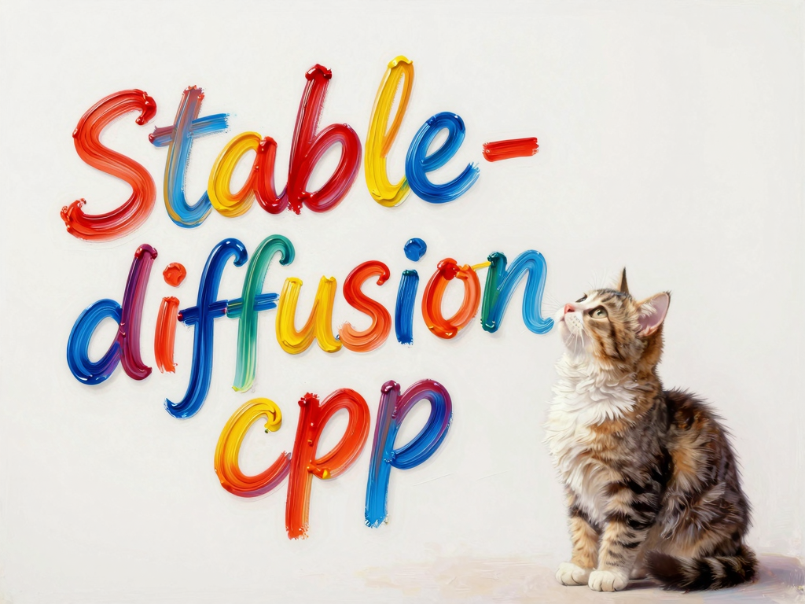

<p align="center">
  
</p>

# stable-diffusion.cpp for Qualcomm devices

This branch provides optimized stable-diffusion.cpp and GGML paths for Qualcomm Hexagon NPUs and Adreno GPUs. It is used by [Local Dream](https://github.com/xororz/local-dream) for on-device DiT inference.

- GGML tracking: [llama.cpp issue #28904](https://github.com/ggml-org/llama.cpp/issues/28904) and [PR #28952](https://github.com/ggml-org/llama.cpp/pull/28952)
- SD.cpp integration: [stable-diffusion.cpp PR #1970](https://github.com/leejet/stable-diffusion.cpp/pull/1970)
- Upstream project: [leejet/stable-diffusion.cpp](https://github.com/leejet/stable-diffusion.cpp)

## Important News

| Date | Update |
|---|---|
| 2026-09-17 | Added Hexagon NPU support for Z-Image Turbo and FLUX.2/Klein 4B. |
| 2026-09-20 | Added Hexagon NPU support for FLUX.2/Klein 9B Q4_0. |

## Hexagon NPU

### Weights

- Text encoder: export Qwen3-4B as Q4_0 with stable-diffusion.cpp, or use [`llm.gguf`](https://huggingface.co/zhiyuanasad/z_image_turbo_adreno/blob/main/llm.gguf) from [zhiyuanasad/z_image_turbo_adreno](https://huggingface.co/zhiyuanasad/z_image_turbo_adreno).
- Z-Image Turbo FP8: [`z-image-turbo_fp8_scaled_e4m3fn_KJ.safetensors`](https://huggingface.co/Kijai/Z-Image_comfy_fp8_scaled/blob/main/z-image-turbo_fp8_scaled_e4m3fn_KJ.safetensors).
- FLUX.2/Klein 4B FP8: [`flux-2-klein-4b-fp8.safetensors`](https://huggingface.co/black-forest-labs/FLUX.2-klein-4b-fp8/blob/main/flux-2-klein-4b-fp8.safetensors).

### Performance

Device: Snapdragon 8 Elite, SM8750, HTP v79. Text encoder, DiT, and VAE run on HTP. Prompt: `a lovely cat`. Sampler: Euler. CFG: 1. Seed: 42. E2E includes text encoding, all sampling steps, and VAE decoding.

| Model | Resolution | Steps | Upstream Q4_0 DiT | FP8 DiT | VAE | E2E |
|---|---:|---:|---:|---:|---:|---:|
| Z-Image Turbo | 1024x1024 | 8 | **91.03 s/it** | **10.26 s/it** | 2.47 s | 100.54 s |
| FLUX.2/Klein 4B | 1024x1024 | 4 | **79.42 s/it** | **8.54 s/it** | 2.14 s | 49.89 s |
| Z-Image Turbo | 1536x1536 | 8 | **OOM** | **32.91 s/it** | 9.08 s | 306.03 s |
| FLUX.2/Klein 4B | 1536x1536 | 4 | **OOM** | **22.42 s/it** | 5.44 s | 111.68 s |
| Z-Image Turbo | 2048x2048 | 4 | **OOM** | **72.51 s/it** | 14.24 s | 307.07 s |
| FLUX.2/Klein 4B | 2048x2048 | 4 | **OOM** | **46.24 s/it** | 19.28 s | 210.77 s |

The 1024 and 1536 runs use direct VAE decode. The 2048 runs use 64x64 VAE tiles. At 1K, FP8 is 8.87x faster for Z-Image and 9.30x faster for FLUX.2/Klein than the current upstream Hexagon Q4_0/Q8_0 path.

### Images

| Z-Image Turbo | FLUX.2/Klein 4B |
|---|---|
| **1024x1024, 8 steps**<br> | **1024x1024, 4 steps**<br> |
| **1536x1536, 8 steps**<br> | **1536x1536, 4 steps**<br> |
| **2048x2048, 4 steps**<br> | **2048x2048, 4 steps**<br> |

### FLUX.2/Klein 9B

Klein 9B uses Q4_0 DiT and Q4_0 Qwen3-8B weights. Text encoder parameters are released after conditioning with `te=disk`; DiT, text encoding, and VAE execution all run on HTP.

- DiT: [`flux-2-klein-9b-Q4_0.gguf`](https://huggingface.co/leejet/FLUX.2-klein-9B-GGUF/blob/main/flux-2-klein-9b-Q4_0.gguf)
- Text encoder: [`Qwen_Qwen3-8B-Q4_0.gguf`](https://huggingface.co/bartowski/Qwen_Qwen3-8B-GGUF/blob/main/Qwen_Qwen3-8B-Q4_0.gguf)
- VAE: [`flux2-vae.safetensors`](https://huggingface.co/unsloth/FLUX.2-VAE/blob/main/split_files/vae/flux2-vae.safetensors)

| Resolution | Steps | Warm DiT | VAE decode | E2E |
|---|---:|---:|---:|---:|
| 1024x1024 | 4 | **15.52 s/it** | 2.25 s | **77.76 s** |


```sh
./sd-cli \
  --diffusion-model flux-2-klein-9b-Q4_0.gguf \
  --llm Qwen3-8B-Q4_0.gguf \
  --vae flux2-vae.safetensors \
  --backend diffusion=HTP0,te=HTP0,vae=HTP0 \
  --params-backend te=disk \
  --fa --vae-conv-direct \
  -t 4 \
  -p 'A cinematic photograph of a red fox standing on a moss-covered stone bridge in an autumn forest, golden morning light, mist between the trees, highly detailed fur, natural colors' \
  --cfg-scale 1 --steps 4 --sampling-method euler \
  -W 1024 -H 1024 --seed 42 \
  -o klein9b_q40_segmented_1024_s4.png
```

### Commands

Place `sd-cli`, `libggml-htp-v79.so`, the model files, and the VAE files in the current directory, then run:

```sh
export LD_LIBRARY_PATH="$PWD" ADSP_LIBRARY_PATH="$PWD"
```

#### Z-Image Turbo, 1024x1024, 8 steps

```sh
./sd-cli \
  --diffusion-model z-image-turbo_fp8_scaled_e4m3fn_KJ.safetensors \
  --llm llm.gguf \
  --vae ae.safetensors \
  --backend diffusion=HTP0,te=HTP0,vae=HTP0 \
  --fa --vae-conv-direct \
  -t 4 -p "a lovely cat" --cfg-scale 1 \
  --steps 8 --sampling-method euler \
  -W 1024 -H 1024 --seed 42 \
  -o zimage_1024_s8.png
```

#### FLUX.2/Klein 4B, 1024x1024, 4 steps

```sh
./sd-cli \
  --diffusion-model flux-2-klein-4b-fp8.safetensors \
  --llm llm.gguf \
  --vae flux2-vae.safetensors \
  --backend diffusion=HTP0,te=HTP0,vae=HTP0 \
  --fa --vae-conv-direct \
  -t 8 -p "a lovely cat" --cfg-scale 1 \
  --steps 4 --sampling-method euler \
  -W 1024 -H 1024 --seed 42 \
  -o klein_1024_s4.png
```

#### Z-Image Turbo, 1536x1536, 8 steps

```sh
./sd-cli \
  --diffusion-model z-image-turbo_fp8_scaled_e4m3fn_KJ.safetensors \
  --llm llm.gguf \
  --vae ae.safetensors \
  --backend diffusion=HTP0,te=HTP0,vae=HTP0 \
  --fa --vae-conv-direct \
  -t 8 -p "a lovely cat" --cfg-scale 1 \
  --steps 8 --sampling-method euler \
  -W 1536 -H 1536 --seed 42 \
  -o zimage_1536_s8.png
```

#### FLUX.2/Klein 4B, 1536x1536, 4 steps

```sh
./sd-cli \
  --diffusion-model flux-2-klein-4b-fp8.safetensors \
  --llm llm.gguf \
  --vae flux2-vae.safetensors \
  --backend diffusion=HTP0,te=HTP0,vae=HTP0 \
  --fa --vae-conv-direct \
  -t 8 -p "a lovely cat" --cfg-scale 1 \
  --steps 4 --sampling-method euler \
  -W 1536 -H 1536 --seed 42 \
  -o klein_1536_s4.png
```

#### Z-Image Turbo, 2048x2048, 4 steps

```sh
./sd-cli \
  --diffusion-model z-image-turbo_fp8_scaled_e4m3fn_KJ.safetensors \
  --llm llm.gguf \
  --vae ae.safetensors \
  --backend diffusion=HTP0,te=HTP0,vae=HTP0 \
  --params-backend te=disk \
  --fa --vae-conv-direct \
  --vae-tiling --vae-tile-size 64x64 --vae-tile-overlap 0.25 \
  -t 4 -p "a lovely cat" --cfg-scale 1 \
  --steps 4 --sampling-method euler \
  -W 2048 -H 2048 --seed 42 \
  -o zimage_2048_s4.png
```

#### FLUX.2/Klein 4B, 2048x2048, 4 steps

```sh
./sd-cli \
  --diffusion-model flux-2-klein-4b-fp8.safetensors \
  --llm llm.gguf \
  --vae flux2-vae.safetensors \
  --backend diffusion=HTP0,te=HTP0,vae=HTP0 \
  --fa --vae-conv-direct \
  --vae-tiling --vae-tile-size 64x64 --vae-tile-overlap 0.25 \
  -t 4 -p "a lovely cat" --cfg-scale 1 \
  --steps 4 --sampling-method euler \
  -W 2048 -H 2048 --seed 42 \
  -o klein_2048_s4.png
```

### FP8 versus upstream Q4_0/Q8_0

Resolution: 1024x1024. Sampling steps: 8.

> 雨夜的未来上海外滩，镜头前是一辆旧式有轨电车穿过积水街道，街边霓虹牌同时写着“欢迎光临”“火锅”“Open 24 Hours”，远处玻璃摩天楼与石库门老建筑并列，空中漂浮无人机广告屏，屏幕上有清晰汉字“春风得意”，画面里有穿风衣的人群、红色雨伞、湿漉漉的柏油路反射青蓝与橙红灯光，构图复杂、层次深、电影感、超细节

| Upstream Q4_0 + Q8_0 | F8_E4M3 |
|---|---|
|  |  |

### Image editing

Z-Image Turbo generates the reference image, then FLUX.2/Klein removes the Einstein field equation while preserving the rest of the scene.

| Z-Image Turbo reference | FLUX.2/Klein edit |
|---|---|
| **1024x1024, 8 steps**<br> | **1024x1024, 4 steps**<br> |

#### Generate the reference with Z-Image Turbo

```sh
./sd-cli \
  --diffusion-model z-image-turbo_fp8_scaled_e4m3fn_KJ.safetensors \
  --llm llm.gguf \
  --vae ae.safetensors \
  --backend diffusion=HTP0,te=HTP0,vae=HTP0 \
  --fa --vae-conv-direct \
  -t 4 \
  -p "爱因斯坦站在黑板前教学，身前是有SJTU标志的讲台桌，手持粉笔。黑板上清晰写着爱因斯坦场方程：G_μν + Λg_μν = 8πG T_μν；以及麦克斯韦方程微分形式：dF = 0，d*F = *J。写实风格，大学课堂，学术氛围。" \
  --cfg-scale 1 --steps 8 --sampling-method euler \
  -W 1024 -H 1024 --seed 42 \
  -o zimage_einstein_1024_s8.png
```

#### Edit with FLUX.2/Klein

```sh
./sd-cli \
  --diffusion-model flux-2-klein-4b-fp8.safetensors \
  --llm llm.gguf \
  --vae flux2-vae.safetensors \
  --backend diffusion=HTP0,te=HTP0,vae=HTP0 \
  --fa --vae-conv-direct \
  -t 4 \
  -p "删除黑板上的爱因斯坦场方程‘G_μν + Λg_μν = 8πG T_μν’，将该公式擦除干净并自然补全黑板背景。保留麦克斯韦方程‘dF = 0，d*F = *J’、爱因斯坦、带SJTU标志的讲台桌、粉笔、大学课堂和其他画面内容不变，保持写实风格。" \
  --ref-image zimage_einstein_1024_s8.png \
  --cfg-scale 1 --steps 4 --sampling-method euler \
  -W 1024 -H 1024 --seed 42 \
  -o klein_edit_remove_equation_1024_s4.png
```

## Adreno GPU

| Model | Size / steps | Before s/it | After s/it | Before sampling (s) | After sampling (s) |
|---|---|---:|---:|---:|---:|
| Klein 4B | 512 / 4 | 11.81 | 5.45 | 52.76 | 25.54 |
| Klein 4B | 1024 / 4 | 37.65 | 21.15 | 154.09 | 90.84 |
| Z-Image Turbo | 512 / 8 | 12.65 | 6.88 | 107.48 | 60.59 |
| Z-Image Turbo | 1024 / 8 | 65.03 | 36.27 | 505.22 | 292.91 |

### Images

| Case | Before | After |
|---|---|---|
| Klein 512, 4 steps |  |  |
| Klein 1024, 4 steps |  |  |
| Z-Image 512, 8 steps |  |  |
| Z-Image 1024, 8 steps |  |  |

### Model weights

The GGUF weights can be converted with stable-diffusion.cpp or downloaded directly from [Flux.2 Klein Adreno](https://huggingface.co/zhiyuanasad/flux2_klein_adreno) and [Z-Image Turbo Adreno](https://huggingface.co/zhiyuanasad/z_image_turbo_adreno).

### Commands

Build with `GGML_OPENCL_USE_ADRENO_KERNELS=ON`.

```sh
export GGML_OPENCL_Q4_0_DENSE_DP4A=1
export GGML_OPENCL_XMEM_SDPA=1
```

#### Klein 512

```sh
./sd-cli --diffusion-model models/flux-2-klein-4b-Q4_0.gguf --llm models/qwen_3_4b-Q4_0.gguf --vae models/flux2-vae.safetensors -p 'a lovely cat' --cfg-scale 1 --guidance 3.5 --steps 4 --seed 42 -W 512 -H 512 --diffusion-fa --vae-conv-direct -t 4 -v -o klein_512.png
```

#### Klein 1024

```sh
./sd-cli --diffusion-model models/flux-2-klein-4b-Q4_0.gguf --llm models/qwen_3_4b-Q4_0.gguf --vae models/flux2-vae.safetensors -p 'a lovely cat' --cfg-scale 1 --guidance 3.5 --steps 4 --seed 42 -W 1024 -H 1024 --diffusion-fa --vae-conv-direct -t 4 -v -o klein_1024.png
```

#### Z-Image 512

```sh
./sd-cli --diffusion-model models/z_image_turbo-Q4_0-nobf16.gguf --llm models/qwen_3_4b-Q4_0.gguf --vae models/ae_old.safetensors -p 'a lovely cat wearing black sunglasses, studio photo' --cfg-scale 1 --guidance 3.5 --steps 8 --seed 42 -W 512 -H 512 --diffusion-fa --vae-conv-direct -t 4 -v -o zimage_512.png
```

#### Z-Image 1024

```sh
./sd-cli --diffusion-model models/z_image_turbo-Q4_0-nobf16.gguf --llm models/qwen_3_4b-Q4_0.gguf --vae models/ae_old.safetensors -p 'a lovely cat wearing black sunglasses, studio photo' --cfg-scale 1 --guidance 3.5 --steps 8 --seed 42 -W 1024 -H 1024 --diffusion-fa --vae-conv-direct -t 4 -v -o zimage_1024.png
```
