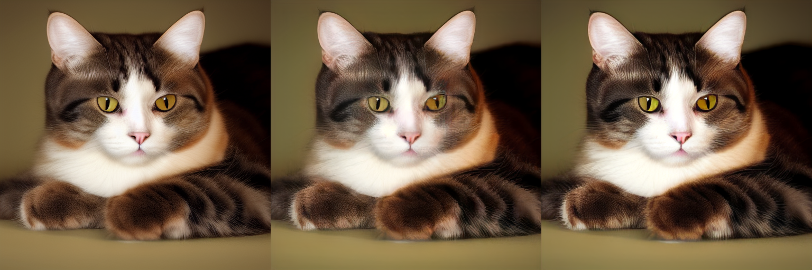
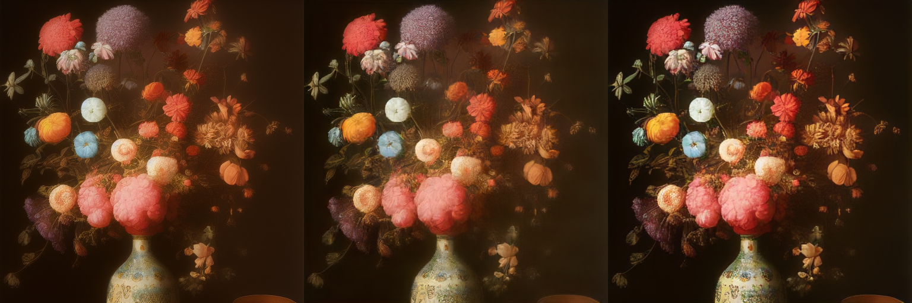
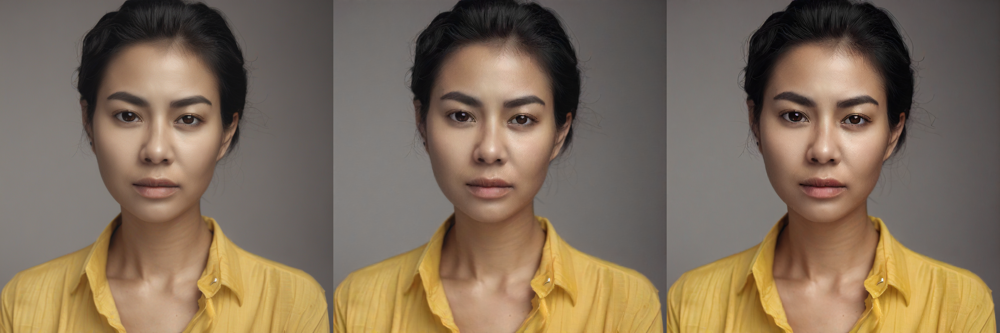

## Introduce an enhanced version of lightweight vae
We'd like to introduce our recent work [Hybrid-SD](https://github.com/bytedance/Hybrid-SD.git). It provides a [Hybrid-sd-tinyvae](https://huggingface.co/cqyan/hybrid-sd-tinyvae) TinyAutoencoder and a [Hybrid-sd-tinyvae-xl](https://huggingface.co/cqyan/hybrid-sd-tinyvae-xl) TinyAutoencoder, which are finetuned version of [TAESD](https://huggingface.co/madebyollin/taesd) and [TAESDXL](https://huggingface.co/madebyollin/taesdxl) respectively. We aim to fix the low-saturation and low-resolution problem in SD1.x and SDXL, while narrowing the loss from using smaller decoders. You can use our models to accelerate the decoding of latent images in base model SD1.x or SDXL by following these steps:
<br />
<br />

### Hybrid-sd-tinyvae for SD1.x
Download the model weight [Hybrid-sd-tinyvae](https://huggingface.co/cqyan/hybrid-sd-tinyvae) 
```bash
curl -L -O https://huggingface.co/cqyan/hybrid-sd-tinyvae/blob/main/diffusion_pytorch_model.safetensors
```

T2I Comparison using one A100 GPU, with default setting,  The image order from left to right : SD1.4-VAE -> TAESD -> Hybrid-sd-tinyvae


Specify the model path using the `--taesd PATH` parameter. example:
```bash
sd -m ../models/v1-5-pruned-emaonly.safetensors -p "a lovely cat" --taesd ../models/diffusion_pytorch_model.safetensors
```
<br />


### Hybrid-sd-tinyvae for SDXL
Download the model weight [Hybrid-sd-tinyvae-xl](https://huggingface.co/cqyan/hybrid-sd-tinyvae-xl) 
```bash
curl -L -O https://huggingface.co/cqyan/hybrid-sd-tinyvae-xl/blob/main/diffusion_pytorch_model.safetensors
```
T2I Comparison using one A100 GPU, with setting `-H 1024 -W 1024 --steps 40 --type f16 --seed 42 --cfg-scale 7 --sampling-method dpm++2m` \
The image order from left to right : SDXL -> TAESDXL -> Hybrid-sd-tinyvae-xl


Specify the model path using the `--taesd PATH` parameter. example:
```bash
./bin/sd -m ../models/sd_xl_base_1.0.safetensors -p "a lovely cat" --taesd ../models/diffusion_pytorch_model.safetensors -H 1024 -W 1024 --steps 40 --type f16 --seed 42 --cfg-scale 7 --sampling-method dpm++2m --rng cuda -v

```
