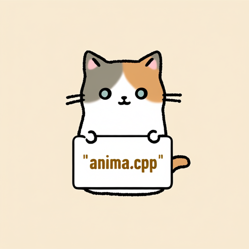

# How to Use

## Download weights

- Download Anima
    - safetensors: https://huggingface.co/circlestone-labs/Anima/tree/main/split_files/diffusion_models
    - gguf: https://huggingface.co/Bedovyy/Anima-GGUF/tree/main
- Download vae
    - safetensors: https://huggingface.co/circlestone-labs/Anima/tree/main/split_files/vae
- Download Qwen3-0.6B-Base
    - safetensors: https://huggingface.co/circlestone-labs/Anima/tree/main/split_files/text_encoders
    - gguf: https://huggingface.co/mradermacher/Qwen3-0.6B-Base-GGUF/tree/main

## Examples

```sh
.\bin\Release\sd-cli.exe --diffusion-model  ..\..\ComfyUI\models\diffusion_models\anima-preview.safetensors --vae ..\..\ComfyUI\models\vae\qwen_image_vae.safetensors  --llm ..\..\ComfyUI\models\text_encoders\qwen_3_06b_base.safetensors  -p "a lovely cat holding a sign says 'anima.cpp'" --cfg-scale 6.0 --sampling-method euler -v --offload-to-cpu --diffusion-fa
```

