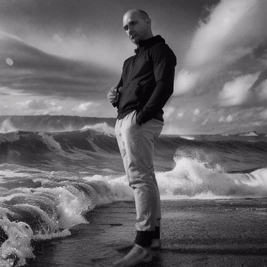
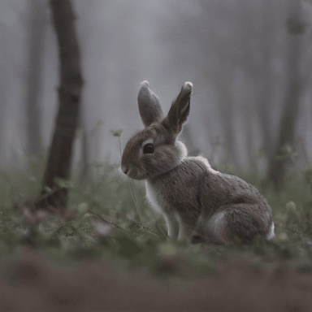
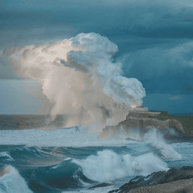
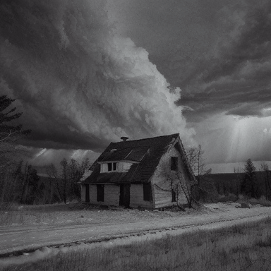
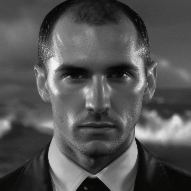
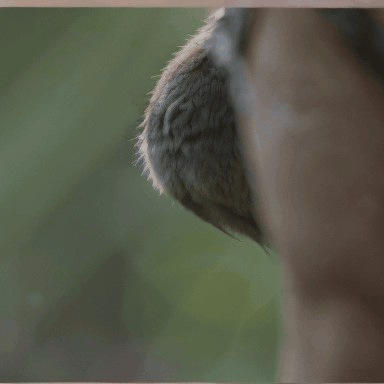
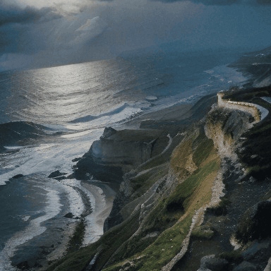
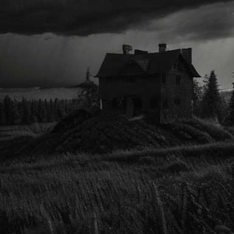
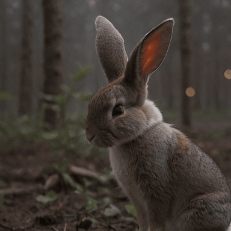
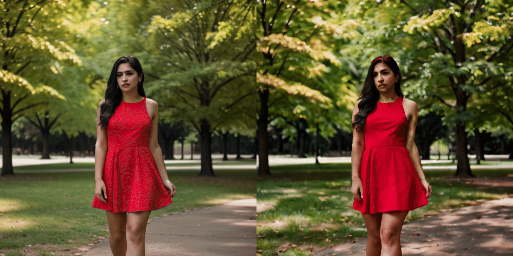

# AnimateDiff (SD 1.5)

AnimateDiff adds motion to a frozen Stable Diffusion 1.5 checkpoint by
injecting a temporal-attention module at 20 UNet slots. The base SD 1.5
model, VAE, and text encoder are unchanged; only the motion module produces
the temporal residual that turns a batch of independent frames into a
coherent animation. Reference: Guo et al., "AnimateDiff: Animate Your
Personalized Text-to-Image Diffusion Models without Specific Tuning"
(https://arxiv.org/abs/2307.04725).

## Download weights

- Motion module (v3, recommended)
    - fp16 safetensors: https://huggingface.co/conrevo/AnimateDiff-A1111/resolve/main/motion_module/mm_sd15_v3.safetensors
    - original checkpoint: https://huggingface.co/guoyww/animatediff/resolve/main/v3_sd15_mm.ckpt
- SD 1.5 base model
    - any SD 1.5 checkpoint works. `realisticVisionV60B1` and `toonyou_beta3`
      are the ones used in guoyww's reference configs.
- Domain Adapter LoRA (optional, v3 only, sharpens the base UNet's output
  toward the motion module's trained distribution)
    - ckpt: https://huggingface.co/guoyww/animatediff/resolve/main/v3_sd15_adapter.ckpt
    - place under your `--lora-model-dir` and reference in the prompt as
      `<lora:v3_sd15_adapter:1.0>`.

The motion module is `~836 MB` and loads alongside the SD 1.5 UNet via
`--motion-module`.

## Motion module versions

Per [animatediff.net/models](https://animatediff.net/models):

| Module              | Base | Native res | Character |
|---------------------|------|------------|-----------|
| `mm_sd_v14.ckpt`    | 1.5  | 256x256    | earliest, more jittery |
| `mm_sd_v15.ckpt`    | 1.5  | 256x256    | improved stability over v1.4 |
| `mm_sd_v15_v2.ckpt` | 1.5  | 384x384    | significantly better motion dynamics |
| `v3_sd15_mm.ckpt`   | 1.5  | 512x512    | smoothest, highest quality; pairs with a Domain Adapter LoRA |
| `mm_sdxl_v10_beta`  | SDXL | 512x512    | experimental, not yet supported here |

Match your `-H -W` to the module's native resolution for best results. v3 is
trained at 512x512 - going smaller (e.g. 384x384) still works but the motion
character is closer to v2.

## Examples

Generate an 8-frame animation at 512x512, seed 42, 20 steps. The sampler /
scheduler / CFG values below match what mm_sd15_v3 was trained with; using
SD 1.5 defaults (euler_a, low CFG) produces noise-like output.

```
.\bin\Release\sd-cli.exe -M vid_gen \
    --model ..\models\checkpoints\realisticVisionV60B1.safetensors \
    --motion-module ..\models\animatediff\mm_sd15_v3.safetensors \
    --offload-to-cpu --diffusion-fa \
    -p "a red apple on a wooden table" \
    --cfg-scale 8.0 --sampling-method euler --scheduler discrete \
    -H 512 -W 512 --video-frames 8 --fps 8 --steps 20 -s 42 \
    -o out.avi
```

Generate at the motion module's native 16-frame context (recommended for
best temporal quality). Needs more VRAM at 512x512, so drop to 384x384 or
use layer streaming:

```
.\bin\Release\sd-cli.exe -M vid_gen \
    --model ..\models\checkpoints\realisticVisionV60B1.safetensors \
    --motion-module ..\models\animatediff\mm_sd15_v3.safetensors \
    --offload-to-cpu --diffusion-fa \
    -p "photo of coastline, rocks, storm weather, wind, waves, lightning" \
    --cfg-scale 8.0 --sampling-method euler --scheduler discrete \
    -H 384 -W 384 --video-frames 16 --fps 8 --steps 20 -s 42 \
    -o out.avi
```

Low-VRAM streaming (verified with a 2 GiB cap on RTX 3060):

```
.\bin\Release\sd-cli.exe -M vid_gen \
    --model ..\models\checkpoints\realisticVisionV60B1.safetensors \
    --motion-module ..\models\animatediff\mm_sd15_v3.safetensors \
    --max-vram 2.0 --stream-layers --diffusion-fa \
    -p "photo of coastline, rocks, storm weather, wind, waves, lightning" \
    --cfg-scale 8.0 --sampling-method euler --scheduler discrete \
    -H 384 -W 384 --video-frames 8 --fps 8 --steps 20 -s 42 \
    -o out.avi
```

## Reference-quality reproduction

Using guoyww's official reference configs on this impl (RealisticVision v6.0
base + `mm_sd15_v3` or `mm_sd_v15_v2` + native resolution + 16 frames + euler
+ 25 steps + CFG 8 + linear beta schedule) reproduces the reference
AnimateDiff output style.

### v3 (512x512, `mm_sd15_v3`)

| Prompt                                | Sample |
|---------------------------------------|--------|
| B&W man on stormy coastline           |     |
| Close-up rabbit macro shot            |  |
| Coastline, storm, waves, lightning    |   |
| Old house, storm, forest, night       |   |

### v2 (384x384, `mm_sd_v15_v2.ckpt`)

| Prompt                                | Sample |
|---------------------------------------|--------|
| B&W man on stormy coastline           |     |
| Close-up rabbit macro shot            |  |
| Coastline, storm, waves, lightning    |   |
| Old house, storm, forest, night       |   |

Motion is strong for scenes with motion cues in the prompt (storm/waves/wind)
and subtle for static subjects (close-up macro), matching reference behavior.
v2 has an additional motion module at the UNet middle block that v3 dropped;
this impl auto-detects the topology from the checkpoint.

### v3 + Domain Adapter LoRA

Attaching the `v3_sd15_adapter` LoRA sharpens the base UNet output toward
the training distribution the motion module was fine-tuned against. Same
prompt, seed, config as above:



Individual fur strands, glowing inner-ear, and richer forest detail become
visible compared to the no-LoRA rendering.

```
sd-cli -M vid_gen --model realisticVisionV60B1.safetensors \
       --motion-module mm_sd15_v3.safetensors \
       --lora-model-dir ./loras \
       -p "close up photo of a rabbit ...<lora:v3_sd15_adapter:1.0>" ...
```

## img2video

Pass a pre-rendered image via `-i / --init-img` to animate FROM it. All N output frames start from the encoded init latent, then per-frame noise is added at `--strength`. Character identity, composition, and quality are anchored by the init image; the motion module adds subtle motion on top.

Left: init image rendered with `-M img_gen`. Right: 8-frame vid_gen output.



```
sd-cli -M img_gen ... -o init.png                  # any high-quality still
sd-cli -M vid_gen --motion-module mm_sd15_v3.safetensors \
    -i init.png --strength 0.75 \
    --cfg-scale 7.0 --sampling-method euler --scheduler karras \
    -H 512 -W 512 --video-frames 8 --steps 25 -s 42 \
    -p "..." -o out.avi
```

`--strength` controls how far the motion module is allowed to deviate from the init image (higher = more motion, lower = more static).

## Notes

- The motion module was trained at `video_length=16`. Running with
  `--video-frames 16` gives the best coherence; F=8 works but shows a shorter
  motion arc. Frame counts up to 32 are supported by the positional encoding
  but exceed the trained regime and produce more static output.
- At `--video-frames 1` the motion module is skipped entirely and the output
  is bit-identical to `-M img_gen`. This avoids the single-token
  temporal-attention degeneracy that would otherwise emit an untrained-magnitude
  residual on a single-frame sample.
- The base UNet is frozen, so character identity and style follow the SD 1.5
  checkpoint you pass to `--model`. LoRAs and prompt weighting attach to the
  base model in the usual way.
- No mid_block motion module in v3. `mm_sdxl_v10_beta` (SDXL variant) is not
  supported yet.
- Output is written as MJPEG AVI. Use `--fps` to set playback speed.
