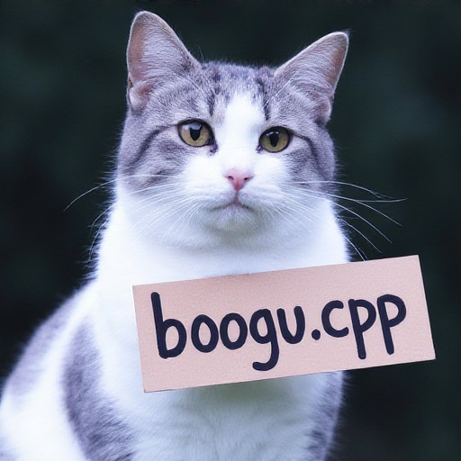
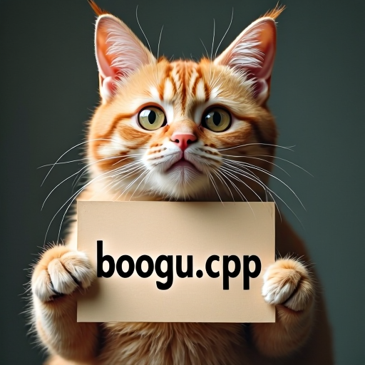

# How to Use

Boogu Image uses a Boogu diffusion transformer, the FLUX VAE, and Qwen3-VL as the LLM text and vision encoder.

## Download weights

- Download Boogu Image
    - safetensors: https://huggingface.co/Comfy-Org/Boogu-Image/tree/main/diffusion_models
- Download vae
    - safetensors: https://huggingface.co/black-forest-labs/FLUX.1-dev/blob/main/ae.safetensors
- Download Qwen3-VL 8B
    - gguf: https://huggingface.co/unsloth/Qwen3-VL-8B-Instruct-GGUF/tree/main
        - For image editing with GGUF text encoders, also download the matching mmproj file and pass it with `--llm_vision`.

## Examples

### Boogu Image Base

```
.\bin\Release\sd-cli.exe --diffusion-model ..\..\ComfyUI\models\diffusion_models\boogu_image_base_bf16.safetensors --llm ..\..\llm\Qwen3VL-8B-Instruct-Q4_K_M.gguf --vae ..\..\ComfyUI\models\vae\ae.sft -p "a lovely cat" --diffusion-fa -v --offload-to-cpu
```



### Boogu Image Edit

```
.\bin\Release\sd-cli.exe --diffusion-model ..\..\ComfyUI\models\diffusion_models\boogu_image_edit_bf16.safetensors --llm ..\..\llm\Qwen3VL-8B-Instruct-Q4_K_M.gguf --llm_vision ..\..\llm\mmproj-Qwen3VL-8B-Instruct-F16.gguf --vae ..\..\ComfyUI\models\vae\ae.sft --diffusion-fa -v --offload-to-cpu -r ..\assets\flux\flux1-dev-q8_0.png -p "change 'flux.cpp' to 'boogu.cpp'"
```

