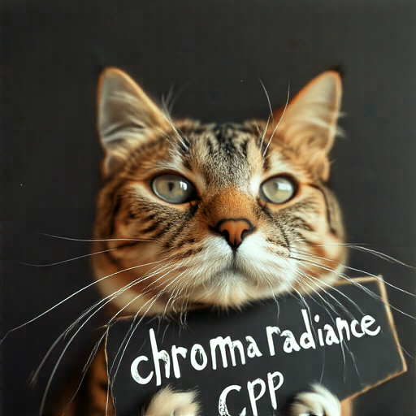

# How to Use

## Download weights

- Download Chroma1-Radiance
    - safetensors: https://huggingface.co/lodestones/Chroma1-Radiance/tree/main
    - gguf: https://huggingface.co/silveroxides/Chroma1-Radiance-GGUF/tree/main

- Download t5xxl
    - safetensors: https://huggingface.co/comfyanonymous/flux_text_encoders/blob/main/t5xxl_fp16.safetensors

## Examples

```
.\bin\Release\sd-cli.exe --diffusion-model  ..\..\ComfyUI\models\diffusion_models\Chroma1-Radiance-v0.4-Q8_0.gguf --t5xxl ..\..\ComfyUI\models\clip\t5xxl_fp16.safetensors  -p "a lovely cat holding a sign says 'chroma  radiance cpp'" --cfg-scale 4.0 --sampling-method euler -v
```




