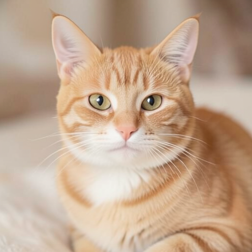
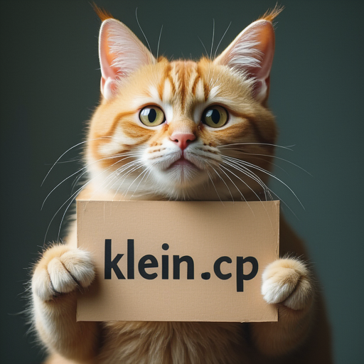
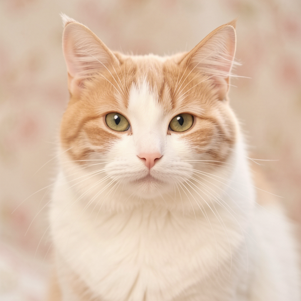
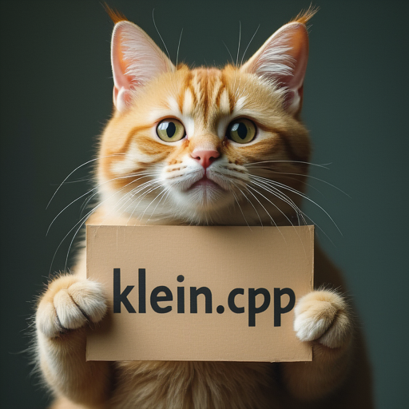
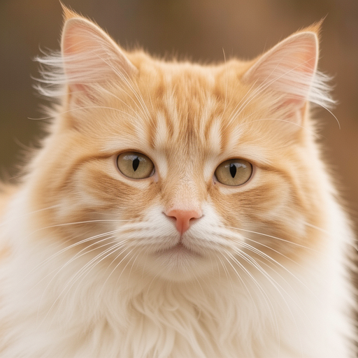

# How to Use

## Flux.2-dev

### Download weights

- Download FLUX.2-dev
    - gguf: https://huggingface.co/city96/FLUX.2-dev-gguf/tree/main
- Download vae
    - safetensors: https://huggingface.co/black-forest-labs/FLUX.2-dev/tree/main
- Download Mistral-Small-3.2-24B-Instruct-2506-GGUF
    - gguf: https://huggingface.co/unsloth/Mistral-Small-3.2-24B-Instruct-2506-GGUF/tree/main

### Examples

```
.\bin\Release\sd-cli.exe --diffusion-model  ..\..\ComfyUI\models\diffusion_models\flux2-dev-Q4_K_S.gguf --vae ..\..\ComfyUI\models\vae\flux2_ae.safetensors  --llm ..\..\ComfyUI\models\text_encoders\Mistral-Small-3.2-24B-Instruct-2506-Q4_K_M.gguf -r .\kontext_input.png -p "change 'flux.cpp' to 'flux2-dev.cpp'" --cfg-scale 1.0 --sampling-method euler -v --offload-to-cpu
```


## Flux.2 klein 4B / Flux.2 klein base 4B

### Download weights

- Download FLUX.2-klein-4B
    - safetensors: https://huggingface.co/black-forest-labs/FLUX.2-klein-4B
    - gguf: https://huggingface.co/leejet/FLUX.2-klein-4B-GGUF/tree/main
- Download FLUX.2-klein-base-4B
    - safetensors: https://huggingface.co/black-forest-labs/FLUX.2-klein-base-4B
    - gguf: https://huggingface.co/leejet/FLUX.2-klein-base-4B-GGUF/tree/main
- Download vae
    - safetensors: https://huggingface.co/black-forest-labs/FLUX.2-dev/tree/main
- Download Qwen3 4b
    - safetensors: https://huggingface.co/Comfy-Org/flux2-klein-4B/tree/main/split_files/text_encoders
    - gguf: https://huggingface.co/unsloth/Qwen3-4B-GGUF/tree/main

### Examples

```
.\bin\Release\sd-cli.exe --diffusion-model  ..\..\ComfyUI\models\diffusion_models\flux-2-klein-4b.safetensors --vae ..\..\ComfyUI\models\vae\flux2_ae.safetensors  --llm ..\..\ComfyUI\models\text_encoders\qwen_3_4b.safetensors -p "a lovely cat" --cfg-scale 1.0 --steps 4 -v --offload-to-cpu --diffusion-fa
```



```
.\bin\Release\sd-cli.exe --diffusion-model  ..\..\ComfyUI\models\diffusion_models\flux-2-klein-4b.safetensors --vae ..\..\ComfyUI\models\vae\flux2_ae.safetensors  --llm ..\..\ComfyUI\models\text_encoders\qwen_3_4b.safetensors -r .\kontext_input.png -p "change 'flux.cpp' to 'klein.cpp'" --cfg-scale 1.0 --sampling-method euler -v --diffusion-fa --offload-to-cpu --steps 4
```



```
.\bin\Release\sd-cli.exe --diffusion-model  ..\..\ComfyUI\models\diffusion_models\flux-2-klein-base-4b.safetensors --vae ..\..\ComfyUI\models\vae\flux2_ae.safetensors  --llm ..\..\ComfyUI\models\text_encoders\qwen_3_4b.safetensors -p "a lovely cat" --cfg-scale 4.0 --steps 20 -v --offload-to-cpu --diffusion-fa
```


## Flux.2 klein 9B / Flux.2 klein base 9B

### Download weights

- Download FLUX.2-klein-9B
    - safetensors: https://huggingface.co/black-forest-labs/FLUX.2-klein-9B
    - gguf: https://huggingface.co/leejet/FLUX.2-klein-9B-GGUF/tree/main
- Download FLUX.2-klein-base-9B
    - safetensors: https://huggingface.co/black-forest-labs/FLUX.2-klein-base-9B
    - gguf: https://huggingface.co/leejet/FLUX.2-klein-base-9B-GGUF/tree/main
- Download vae
    - safetensors: https://huggingface.co/black-forest-labs/FLUX.2-dev/tree/main
- Download Qwen3 8B
    - safetensors: https://huggingface.co/Comfy-Org/flux2-klein-9B/tree/main/split_files/text_encoders
    - gguf: https://huggingface.co/unsloth/Qwen3-8B-GGUF/tree/main

### Examples

```
.\bin\Release\sd-cli.exe --diffusion-model  ..\..\ComfyUI\models\diffusion_models\flux-2-klein-9b.safetensors --vae ..\..\ComfyUI\models\vae\flux2_ae.safetensors  --llm ..\..\ComfyUI\models\text_encoders\qwen_3_8b.safetensors -p "a lovely cat" --cfg-scale 1.0 --steps 4 -v --offload-to-cpu --diffusion-fa
```



```
.\bin\Release\sd-cli.exe --diffusion-model  ..\..\ComfyUI\models\diffusion_models\flux-2-klein-9b.safetensors --vae ..\..\ComfyUI\models\vae\flux2_ae.safetensors  --llm ..\..\ComfyUI\models\text_encoders\qwen_3_8b.safetensors -r .\kontext_input.png -p "change 'flux.cpp' to 'klein.cpp'" --cfg-scale 1.0 --sampling-method euler -v --diffusion-fa --offload-to-cpu --steps 4
```



```
.\bin\Release\sd-cli.exe --diffusion-model  ..\..\ComfyUI\models\diffusion_models\flux-2-klein-base-9b.safetensors --vae ..\..\ComfyUI\models\vae\flux2_ae.safetensors  --llm ..\..\ComfyUI\models\text_encoders\qwen_3_8b.safetensors -p "a lovely cat" --cfg-scale 4.0 --steps 20 -v --offload-to-cpu --diffusion-fa
```

