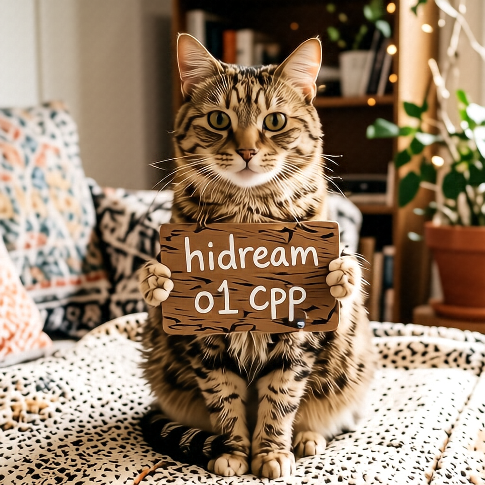

# How to Use

## Download weights

- Download HiDream-O1-Image-Dev
    - safetensors: https://huggingface.co/Comfy-Org/HiDream-O1-Image/tree/main/checkpoints
- Download HiDream-O1-Image
    - safetensors: https://huggingface.co/Comfy-Org/HiDream-O1-Image/tree/main/checkpoints

## Examples

### HiDream-O1-Image-Dev

```
.\bin\Release\sd-cli.exe -m  ..\..\ComfyUI\models\diffusion_models\hidream_o1_image_dev_bf16.safetensors -p "a lovely cat holding a sign says 
'hidream o1 cpp'" --cfg-scale 1.0  -v -H 1024 -W 1024
```



