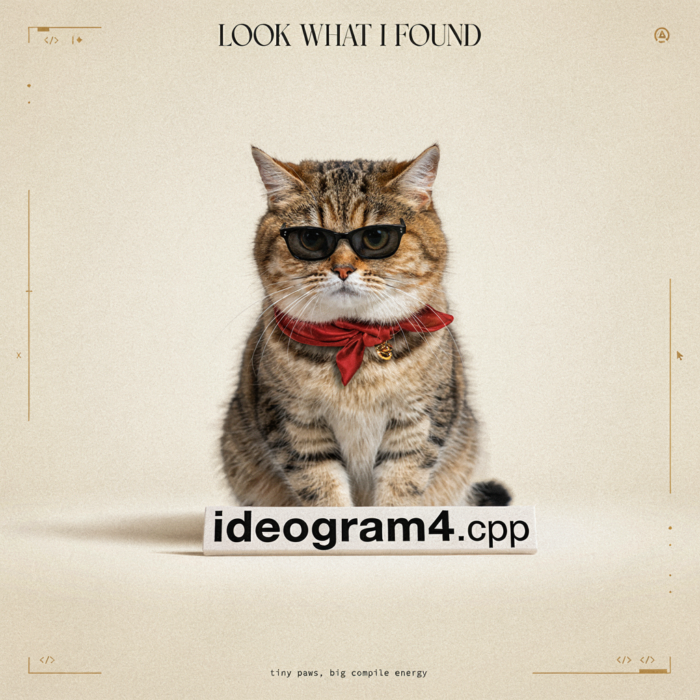

# How to Use

## Download weights

- Download Ideogram4
    - safetensors: https://huggingface.co/ideogram-ai/ideogram-4-fp8/tree/main/transformer
- Download Ideogram4 uncond
    - safetensors: https://huggingface.co/ideogram-ai/ideogram-4-fp8/tree/main/unconditional_transformer
- Download vae
    - safetensors: https://huggingface.co/black-forest-labs/FLUX.2-dev/tree/main
- Download Qwen3-VL-8B-Instruct
    - gguf: https://huggingface.co/unsloth/Qwen3-VL-8B-Instruct-GGUF/tree/main

## Convert weights

fp8 scale -> bf16

```
python .\convert_fp8_scale_to_bf16.py --input .\ideogram4_fp8.safetensors --output ideogram4_bf16.safetensors
python .\convert_fp8_scale_to_bf16.py --input .\ideogram4_uncond_fp8.safetensors --output ideogram4_uncond_bf16.safetensors
```

bf16 -> q8

```
.\bin\Release\sd-cli.exe -M convert -m ideogram4_bf16.safetensors -o ideogram4-Q8_0.gguf --tensor-type-rules "^layers.*adaln_modulation.*weight=q8_0,layers.*attention.o.*weight=q8_0,layers.*attention.qkv.*weight=q8_0,layers.*feed_forward.*weight=q8_0" -v

.\bin\Release\sd-cli.exe -M convert -m ideogram4_uncond_bf16.safetensors -o ideogram4_uncond-Q8_0.gguf --tensor-type-rules "^layers.*adaln_modulation.*weight=q8_0,layers.*attention.o.*weight=q8_0,layers.*attention.qkv.*weight=q8_0,layers.*feed_forward.*weight=q8_0" -v
```

If you want lower VRAM usage, you can change the quantization from q8_0 to a lower-level quantization, such as q4_0.


## Examples

```sh
.\bin\Release\sd-cli.exe --diffusion-model ideogram4-Q8_0.gguf --uncond-diffusion-model ideogram4_uncond-Q8_0.gguf --llm ..\..\llm\Qwen3VL-8B-Instruct-Q4_K_M.gguf --vae ..\..\ComfyUI\models\vae\flux2_ae.safetensors -p '{"high_level_description":"A square 1024 x 1024 luxury fashion magazine cover featuring exactly one short chubby fluffy cat as the main model. The cat sits on a soft ivory studio floor, facing the viewer with a stylish calm expression, wearing tiny black sunglasses, a red silk scarf, and a small gold collar charm. In front of the cat on the floor is a wide horizontal luxury nameplate that clearly reads ideogram4.cpp. The whole design feels premium, fashionable, clean, and editorial.","style_description":{"aesthetics":"luxury fashion magazine cover, high-end pet couture campaign, minimalist editorial design, elegant studio photography, soft paper texture, refined typography, fashionable and polished","lighting":"Soft diffused studio lighting, gentle spotlight on the cat, subtle floor shadow, warm ivory highlights, clean separation between subject and background","photo":"high-resolution fashion editorial photography look, front-facing cat portrait, crisp fur details, glossy sunglasses, clear readable nameplate text, shallow depth of field","medium":"mixed media fashion photography and premium editorial graphic design","color_palette":["#F4EFE7","#111111","#D8B56D","#B73A3A","#FFFFFF","#8A7A6A"]},"compositional_deconstruction":{"canvas":"Square 1024 x 1024 canvas with a normal upright orientation. Do not rotate the poster or any text. Use a clean fashion magazine cover layout.","background":"Warm ivory studio backdrop with subtle paper grain, a soft spotlight gradient, faint floor shadow, and a few minimal gold editorial lines. The background is spacious, premium, and uncluttered.","layout":"Top center has a small elegant headline. Center area features one cat as the main fashion model. Lower foreground has a wide horizontal luxury nameplate placed on the floor in front of the cat. Bottom center has a small footer. All text is horizontal, upright, and readable left to right.","elements":[{"type":"text","desc":"Top center headline reading LOOK WHAT I FOUND in a refined high-fashion serif font. The headline is horizontal, centered, elegant, and secondary to the nameplate text."},{"type":"obj","desc":"Exactly one short chubby fluffy cat sitting in the center like a luxury fashion model. The cat has a large round head, compact body, short legs, soft detailed fur, expressive eyes, and a calm confident pose. The cat is cute and rounded, not tall, not stretched, not duplicated."},{"type":"obj","desc":"Tiny glossy black sunglasses worn naturally by the cat, slightly oversized but still showing the cat face clearly. The sunglasses add a chic fashion-editorial attitude."},{"type":"obj","desc":"A red silk scarf tied neatly around the cat neck, with soft folds and a couture feeling. The scarf must not cover the cat face or the nameplate."},{"type":"obj","desc":"A small gold collar charm or fashion accessory under the scarf, subtle and premium, adding a luxury campaign detail."},{"type":"obj","desc":"In the lower foreground, place a wide horizontal luxury nameplate on the floor in front of the cat. The nameplate is low, flat, landscape-oriented, much wider than tall, like a fashion show seat card or premium display plaque. It is centered, front-facing, level, and fully visible. It must not become vertical, tall, standing, rotated, or side-facing."},{"type":"text","desc":"Print the exact text ideogram4.cpp only on the wide horizontal nameplate. Use clean bold black lettering, perfectly spelled, lowercase, with the number 4 and .cpp extension. The text must fit completely inside the nameplate, stay horizontal, and be readable from left to right."},{"type":"obj","desc":"Add sparse premium editorial accents around the edges: thin gold lines, small code brackets, tiny cursor marks, subtle dots, and minimal geometric details. No extra cats, no stickers, no animal faces, no busy decorations."},{"type":"text","desc":"Bottom center footer reading tiny paws, big compile energy in a small refined monospace or editorial font. The footer is horizontal, centered, understated, and much smaller than the nameplate text."}]}}'  --diffusion-fa -v --offload-to-cpu -H 1024 -W 1024
```


