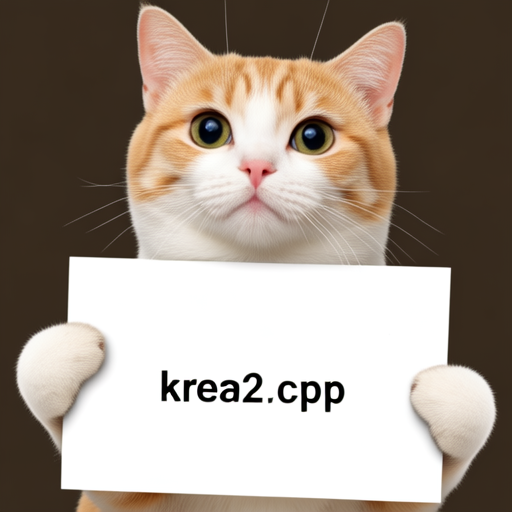

# How to Use

Krea2 uses a Krea2 diffusion transformer, the Wan2.1 VAE, and Qwen3-VL 4B as the LLM text encoder.

## Download weights

- Download Krea2 Raw
    - safetensors: https://huggingface.co/krea/Krea-2-Raw/tree/main
    - gguf: https://huggingface.co/realrebelai/KREA-2_GGUFs/tree/main/BASE
- Download Krea2 Turbo
    - safetensors: https://huggingface.co/krea/Krea-2-Turbo/tree/main
    - gguf: https://huggingface.co/realrebelai/KREA-2_GGUFs/tree/main/TURBO
- Download vae
    - safetensors: https://huggingface.co/Comfy-Org/Wan_2.1_ComfyUI_repackaged/blob/main/split_files/vae/wan_2.1_vae.safetensors
- Download Qwen3-VL 4B
    - safetensors: https://huggingface.co/Comfy-Org/Krea-2/tree/main/text_encoders
    - gguf: https://huggingface.co/Qwen/Qwen3-VL-4B-Instruct-GGUF/tree/main

## Examples

### Krea2

```
.\bin\Release\sd-cli.exe --diffusion-model ..\models\diffusion_models\Krea-2-Raw-Q8_0.gguf --llm ..\models\text_encoders\Qwen3-VL-4B-Instruct-Q4_K_M.gguf --vae ..\models\vae\wan_2.1_vae.safetensors -p "a lovely cat holding a sign says 'krea2.cpp'"  --diffusion-fa -v --offload-to-cpu
```


