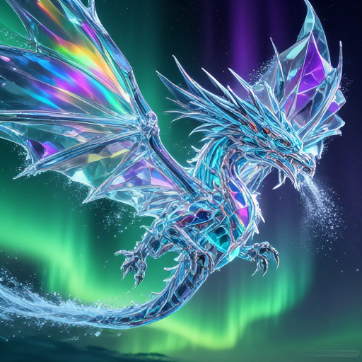
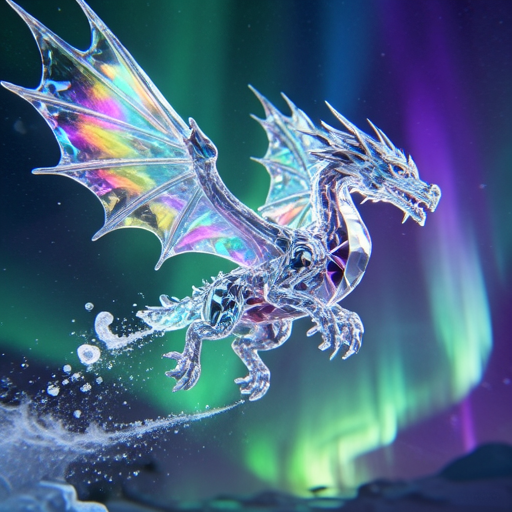

# How to Use

Lens uses a Lens diffusion transformer, the FLUX.2 VAE, and GPT-OSS-20B as the LLM text encoder.

## Download weights

- Download Lens
    - safetensors: https://huggingface.co/Comfy-Org/Lens/tree/main/diffusion_models
- Download Lens Turbo
    - safetensors: https://huggingface.co/Comfy-Org/Lens/tree/main/diffusion_models
- Download vae
    - safetensors: https://huggingface.co/black-forest-labs/FLUX.2-dev/tree/main
- Download GPT-OSS-20B
    - gguf: https://huggingface.co/unsloth/gpt-oss-20b-GGUF/tree/main

## Examples

### Lens

```
.\bin\Release\sd-cli.exe --diffusion-model ..\..\ComfyUI\models\diffusion_models\lens_bf16.safetensors --llm "..\..\llm\gpt-oss-20b-UD-Q8_K_XL.gguf" --vae ..\..\ComfyUI\models\vae\flux2_ae.safetensors --cfg-scale 5.0  -p "A crystal dragon soaring through an aurora borealis sky, its entire body made of transparent faceted crystal refracting the green and purple aurora light into rainbow spectra, ice particles trailing from its wings, high fantasy digital art" --diffusion-fa -v
```



### Lens Turbo

```
.\bin\Release\sd-cli.exe --diffusion-model ..\..\ComfyUI\models\diffusion_models\lens_turbo_bf16.safetensors --llm "..\..\llm\gpt-oss-20b-UD-Q8_K_XL.gguf" --vae ..\..\ComfyUI\models\vae\flux2_ae.safetensors --cfg-scale 1.0  -p "A crystal dragon soaring through an aurora borealis sky, its entire body made of transparent faceted crystal refracting the green and purple aurora light into rainbow spectra, ice particles trailing from its wings, high fantasy digital art" --diffusion-fa -v --steps 4
```


