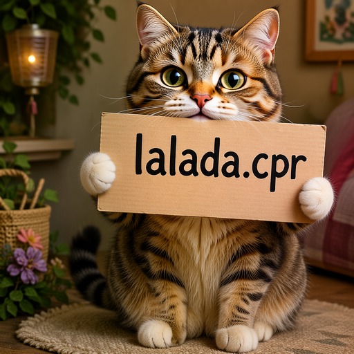

# How to Use

LLaDA-Image is a 6B text-to-image and instruction-guided editing model. The denoiser is a
Lumina2/Z-Image-style NextDiT conditioned by a LLaDA2-MoE diffusion-LLM text encoder, and it
reuses the Flux.2 VAE. Two checkpoints are published: a 50-step base model and
LLaDA-Image-Turbo, a 4-step distilled model.

## Download weights

Four components are required: a transformer, a text encoder, a VAE, and a connectors file
holding the QueryFormer, the text projection and, for editing, the SigVQ image encoder.

The two published checkpoints are **not** interchangeable. LLaDA-Image-Turbo and LLaDA-Image
ship different transformers, text encoders, QueryFormers and text projections; only the VAE,
the SigVQ encoder and the tokenizer are shared. Mixing the two produces degraded output rather
than a clean error, so keep each checkpoint's files together.

Both need an external LLaDA2 `tokenizer.json`, which is not embedded in sd.cpp and is the same
file for either checkpoint. Take `tokenizer/tokenizer.json` from either repository and pass it
with `--tokenizer`. See [JSON tokenizers](tokenizers.md) for CLI and C API usage.

### LLaDA-Image-Turbo (4 steps)

Converted transformer, text encoder and pre-merged connectors are at
https://huggingface.co/fszontagh/LLaDA-Image-Turbo-GGUF:

- `llada-image-turbo-f16.gguf`
- `llada-image-turbo-text_encoder-q8_0.gguf`
- `llada-image-turbo-connectors.safetensors` for text to image, or
  `llada-image-turbo-connectors-edit.safetensors`, which also carries the SigVQ encoder that
  editing needs.

Other quantizations of the transformer and the text encoder are in the same repository.

The VAE comes from the original repository,
https://huggingface.co/inclusionAI/LLaDA-Image-Turbo: `vae/diffusion_pytorch_model.safetensors`,
referred to below as `llada_vae.safetensors`.

### LLaDA-Image (50 steps)

Converted transformer, text encoder and pre-merged connectors are at
https://huggingface.co/fszontagh/LLaDA-Image-GGUF:

- `llada-image-f16.gguf`
- `llada-image-text_encoder-q8_0.gguf`
- `llada-image-connectors.safetensors` for text to image, or
  `llada-image-connectors-edit.safetensors`, which also carries the SigVQ encoder that editing
  needs.

Other quantizations of the transformer and the text encoder are in the same repository.

The VAE comes from the original repository,
https://huggingface.co/inclusionAI/LLaDA-Image, and is the same file as the Turbo one.

### Converting the weights yourself

The transformer has to go in through `--diffusion-model` so that its tensor names keep the
prefix the loader expects, while the text encoder goes in through `-m`:

```bash
./bin/sd-cli -M convert --diffusion-model transformer/diffusion_pytorch_model.safetensors.index.json \
  -o llada-image-f16.gguf --type f16
./bin/sd-cli -M convert -m text_encoder/model.safetensors.index.json \
  -o llada-image-text_encoder-q8_0.gguf --type q8_0
```

### Building the connector file yourself

`--embeddings-connectors` takes one file, so the QueryFormer, the text projection and
(for editing) the SigVQ encoder have to be combined into a single Safetensors file, each
tensor name prefixed with its component name. Leaving `sigvq` out skips loading the 2.6 GB
encoder:

```python
from safetensors.torch import load_file, save_file

merged = {}
for prefix, path in [
    ("queryformer", "queryformer/diffusion_pytorch_model.safetensors"),
    ("text_projection", "text_projection/diffusion_pytorch_model.safetensors"),
    ("sigvq", "sigvq/diffusion_pytorch_model.safetensors"),
]:
    for name, tensor in load_file(path).items():
        merged[f"{prefix}.{name}"] = tensor
save_file(merged, "llada_connectors.safetensors")
```

## Examples

### Text to image

```bash
./bin/sd-cli \
  --diffusion-model /path/to/llada-image-turbo-f16.gguf \
  --llm /path/to/llada-image-turbo-text_encoder-q8_0.gguf \
  --tokenizer /path/to/tokenizer.json \
  --vae /path/to/llada_vae.safetensors \
  --embeddings-connectors /path/to/llada-image-turbo-connectors.safetensors \
  --prompt "a lovely cat holding a sign says 'llada.cpp'" \
  --width 1024 \
  --height 1024 \
  --steps 4 \
  --cfg-scale 1.0 \
  --seed 42 \
  --output output.png
```



### Image editing

```bash
./bin/sd-cli \
  --diffusion-model /path/to/llada-image-turbo-f16.gguf \
  --llm /path/to/llada-image-turbo-text_encoder-q8_0.gguf \
  --tokenizer /path/to/tokenizer.json \
  --vae /path/to/llada_vae.safetensors \
  --embeddings-connectors /path/to/llada-image-turbo-connectors-edit.safetensors \
  --ref-image /path/to/input.png \
  --prompt "change the sign text to 'sd.cpp'" \
  --width 1024 \
  --height 1024 \
  --steps 4 \
  --cfg-scale 1.0 \
  --diffusion-fa \
  --output output.png
```


See [edit.md](./edit.md) for the shared reference-image options. LLaDA-Image uses the
`llada_image` preset by default, resizing the reference image to the output width and height
before VAE encoding. SigVQ uses bilinear resizing to half the output resolution and inputs
normalized to `[-1, 1]`. CFG keeps the source latent in both branches and uses SigVQ features
only in the positive branch. Editing requires connectors that include the SigVQ weights.

## Notes

- Use 4 steps and `--cfg-scale 1.0` for LLaDA-Image-Turbo; the guidance is distilled away, so
  a higher CFG degrades output and doubles the text encoder cost. The 50-step base model uses
  `--steps 50 --cfg-scale 5`.
- Width and height are rounded up to a multiple of 16. For editing the reference pipeline
  requires them to be divisible by 32.
- Edit the 50-step base model at 1024x1024. At 512x512 it returns the reference image almost
  unchanged instead of applying the instruction; LLaDA-Image-Turbo edits correctly at both.
- Editing runs the reference and the target in one sequence, so it needs roughly twice the
  tokens of text to image at the same size. On 12 GB, editing at 1024x1024 needs
  `--diffusion-fa`; without it the diffusion graph does not fit.
- The weights total about 16 GB, but segmented execution streams them, so a much smaller
  budget works. At 512x512, `--max-vram 6` costs almost nothing over unconstrained execution,
  and `--max-vram 3` still produces byte-identical output at roughly 2.5x the time.
- `--scheduler` defaults to `llada_image`, which reproduces the reference Kumaraswamy sigma
  grid. `--extra-sample-args uniform=1` selects the uniform grid instead.
- Prompt templating is handled automatically; pass a plain description.
- VQ-conditioned generation (`generation_mode="vq"`, where the text encoder decodes image
  tokens before diffusion) is not implemented.
