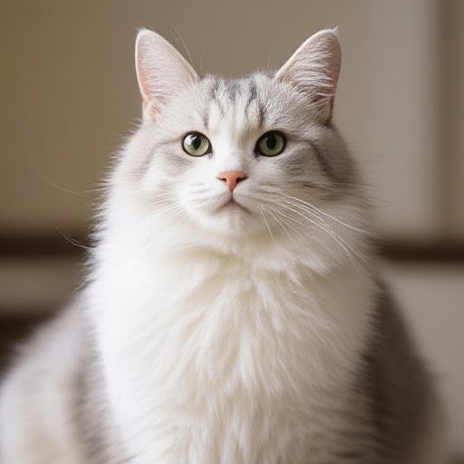

# Ovis-Image

Ovis-Image generates images from text using an Ovis 2.5 encoder and the FLUX VAE.

## Model files

| Component | Weights and downloads | CLI option | Requirement |
| --- | --- | --- | --- |
| Ovis-Image-7B | [Safetensors](https://huggingface.co/Comfy-Org/Ovis-Image/tree/main/split_files/diffusion_models)<br>[GGUF](https://huggingface.co/leejet/Ovis-Image-7B-GGUF) | `--diffusion-model` | Required |
| vae | [Safetensors](https://huggingface.co/black-forest-labs/FLUX.1-schnell/tree/main) | `--vae` | Use matching VAE |
| Ovis 2.5 | [Safetensors](https://huggingface.co/Comfy-Org/Ovis-Image/tree/main/split_files/text_encoders) | `--llm` | Use matching text encoder |

## Usage

### Web UI

Follow the [Web UI guide](../../examples/server/README.md#web-ui) to start the
server, then select the recipe matching your weights. Fill the component slots
below and click **Load models**.
Use the files and compatibility requirements in [Model files](#model-files).

| Recipe | Component slots |
| --- | --- |
| Ovis Image (`ovis-image`) | `diffusion_model`, `llm`, `vae`, `tae` |

Slot IDs correspond to CLI component options: `diffusion_model` uses
`--diffusion-model`, `llm` uses `--llm`, and `model` uses `-m` / `--model`.
Select optional components when required by your checkpoint or task.

### DGL

| Example | Description |
| --- | --- |
| [Text to image](../dgl/ovis_image/ovis-image-txt2img.dgl) | Ovis-Image generation. |

#### Run a script

Edit paths, prompts and settings in the script's `var` block, then run from
the build directory. Paths inside the script resolve from the working directory.

**Windows (PowerShell)**

```powershell
.\bin\Release\sd-cli.exe -M dgl --script ..\docs\dgl\ovis_image\ovis-image-txt2img.dgl
```

**Linux/macOS**

```sh
./bin/sd-cli -M dgl --script ../docs/dgl/ovis_image/ovis-image-txt2img.dgl
```

Choose another script from the table to run a different task. Add `--check`
to validate syntax and types without loading weights. See the
[shared run instructions](../dgl/README.md#run-an-example) for build paths
and the server's file-access rules.

### Legacy CLI

CLI examples use the [shared path and shell conventions](README.md#example-conventions).

**Windows (PowerShell)**

```powershell
.\bin\Release\sd-cli.exe `
  --diffusion-model ..\models\diffusion_models\ovis_image-Q4_0.gguf `
  --vae ..\models\vae\ae.sft `
  --llm ..\models\text_encoders\ovis_2.5.safetensors `
  -p "a lovely cat" `
  --cfg-scale 5.0 `
  --offload-to-cpu `
  -v
```

**Linux/macOS**

```sh
./bin/sd-cli \
  --diffusion-model ../models/diffusion_models/ovis_image-Q4_0.gguf \
  --vae ../models/vae/ae.sft \
  --llm ../models/text_encoders/ovis_2.5.safetensors \
  -p "a lovely cat" \
  --cfg-scale 5.0 \
  --offload-to-cpu \
  -v
```


