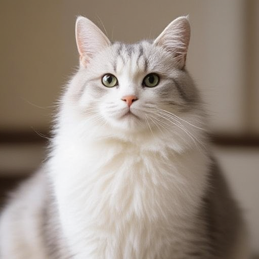

# How to Use

## Download weights

- Download Ovis-Image-7B
    - safetensors: https://huggingface.co/Comfy-Org/Ovis-Image/tree/main/split_files/diffusion_models
    - gguf: https://huggingface.co/leejet/Ovis-Image-7B-GGUF
- Download vae
    - safetensors: https://huggingface.co/black-forest-labs/FLUX.1-schnell/tree/main
- Download Ovis 2.5
    - safetensors: https://huggingface.co/Comfy-Org/Ovis-Image/tree/main/split_files/text_encoders

## Examples

```
.\bin\Release\sd-cli.exe --diffusion-model  ovis_image-Q4_0.gguf --vae ..\..\ComfyUI\models\vae\ae.sft  --llm ..\..\ComfyUI\models\text_encoders\ovis_2.5.safetensors -p "a lovely cat" --cfg-scale 5.0 -v --offload-to-cpu --diffusion-fa
```

