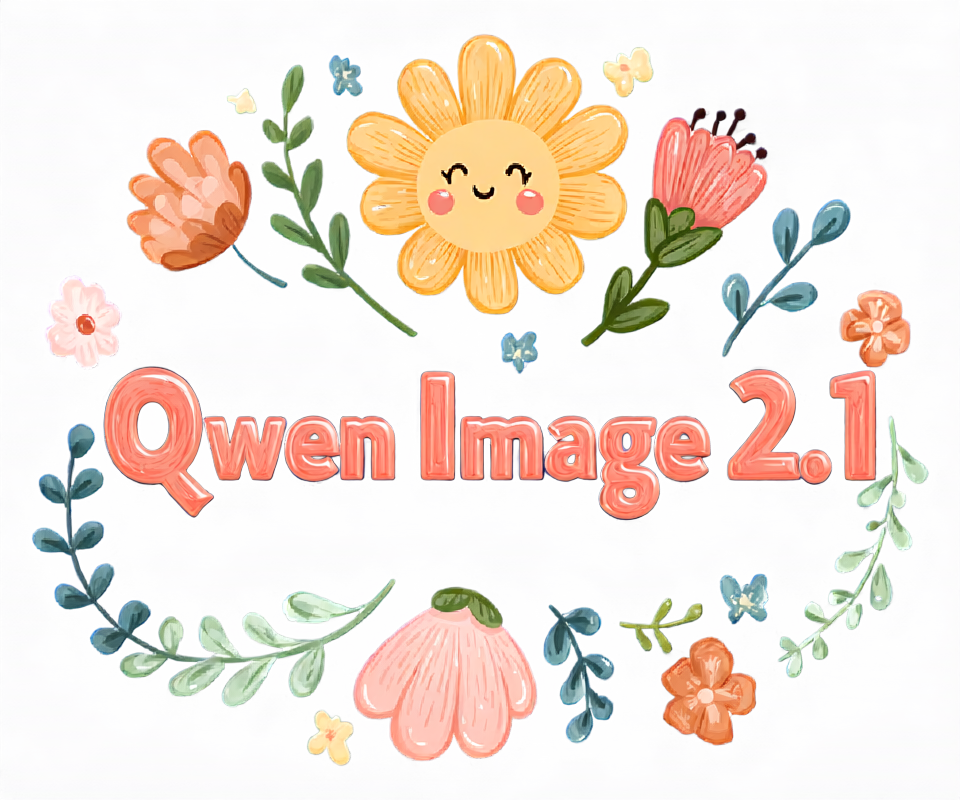

# How to Use

Qwen Image 2.1 supports text-to-image generation and image editing, using Qwen3-VL-8B as the text encoder and its own VAE.

## Download weights

- Download Qwen Image 2.1
    - safetensors: https://huggingface.co/Comfy-Org/Qwen-Image-2.1/tree/main/diffusion_models
    - gguf: https://huggingface.co/leejet/Qwen-Image-2.1-GGUF/tree/main
- Download vae
    - safetensors: https://huggingface.co/Comfy-Org/Qwen-Image-2.1/tree/main/vae
- Download Qwen3-VL-8B-Instruct
    - safetensors (BF16 or INT8 convrot): https://huggingface.co/Comfy-Org/Qwen-Image-2.1/tree/main/text_encoders
    - gguf: https://huggingface.co/Qwen/Qwen3-VL-8B-Instruct-GGUF/tree/main
    - For image editing with a GGUF text encoder, also download `mmproj-Qwen3VL-8B-Instruct-F16.gguf` from the same repository and pass it with `--llm_vision`.

Use `qwen_image_2.1_vae_bf16.safetensors` with this model. The earlier Qwen Image and Wan 2.2 VAE weights are not interchangeable with the Qwen Image 2.1 VAE weights.

## Examples

Run the following commands from the build directory. Use image dimensions divisible by 32. The resolution-dependent flow schedule is selected automatically.

### Text to image

```powershell
.\bin\Release\sd-cli.exe --diffusion-model ..\models\diffusion_models\qwen_image_2.1_int8_convrot.safetensors --vae ..\models\vae\qwen_image_2.1_vae_bf16.safetensors --llm ..\models\text_encoders\Qwen3VL-8B-Instruct-Q4_K_M.gguf -p "a lovely cat holding a sign says 'qwen2.1.cpp'" --cfg-scale 6.0 --sampling-method euler -v --offload-to-cpu --fa -o qwen_image_2.1.png
```


To use GGUF diffusion weights, set `--diffusion-model` to the path of a file such as `qwen_image_2.1-Q4_K.gguf`.

### Image editing

Pass the reference image with `-r` and describe the edit in `-p`. Vision weights are required; the example below loads them separately with `--llm_vision`.

```powershell
.\bin\Release\sd-cli.exe --diffusion-model ..\models\diffusion_models\qwen_image_2.1_int8_convrot.safetensors --vae ..\models\vae\qwen_image_2.1_vae_bf16.safetensors --llm ..\models\text_encoders\Qwen3VL-8B-Instruct-Q4_K_M.gguf --llm_vision ..\models\text_encoders\Qwen3VL-8B-Instruct-mmproj-BF16.gguf -r ..\assets\qwen\qwen_image_2.1.png -p "change 'qwen2.1.cpp' to 'sd.cpp'" --cfg-scale 6.0 --sampling-method euler -v --offload-to-cpu --fa -o qwen_image_2.1_edit.png
```

For multiple reference images, repeat `-r` in the desired order, for example `-r first.png -r second.png`.

### Prefix cache

By default, the first denoising call for each fixed condition saves the text and reference-image keys and values from every transformer layer. Later calls only compute the target-image tokens. Positive and negative conditions use separate caches, which are released when sampling ends.

Set `qwen_image_2_1_prefix_cache_type` in `--model-args` to `auto` or a type name using the same parser and case-sensitive names as `--type`:

- `auto` (default): use FP16 only when Flash Attention is enabled, Sage Attention is disabled, the attention scale is unchanged, and every attention operation in the cache-writing or cache-reading graph selects Flash Attention after backend support checks. If an operation falls back, rebuild the prefix in FP32 before executing and keep FP32 for the rest of that sampling run.
- `f32`: always store FP32 keys and values.
- `f16`: always store FP16 keys and values, including with ordinary attention or custom attention scaling. This saves cache memory but can introduce additional rounding error.
- Other types, such as `bf16`, `q4_1`, `q5_0`, `q5_1`, `q8_0`, `q4_K`, `q6_K`, `iq4_nl`, and `iq4_xs`: use the requested storage type if the ggml build provides runtime conversion to and from FP32. Quantization is lossy and must be selected explicitly; `auto` never selects a quantized type.

Cache data is packed into contiguous rows of `hidden_size` elements before conversion, so 256-element quantization blocks work with the model's 128-element attention heads without padding. The type's block size must divide `hidden_size`. Unknown types, types lacking runtime conversion (for example `q8_1` and several IQ formats), and incompatible block sizes are ignored with a warning, leaving the previous setting or the default `auto` unchanged.

For example, use `--model-args qwen_image_2_1_prefix_cache_type=q8_0` to enable 8-bit cache storage. Cached keys and values are converted back to the attention input type before concatenating with the current target tokens. This reduces persistent cache memory; attention working buffers still use floating-point values, and conversion adds work on each step. Backends without the required conversion operations use the existing CPU fallback.

For the default 32-layer model, a prefix of 4096 tokens takes approximately the following memory per condition, excluding weights, working buffers, and allocation overhead:

| Cache type | Memory |
| --- | ---: |
| `f32` | 4 GiB |
| `f16` | 2 GiB |
| `q8_0` | 1.0625 GiB |
| `q4_0` | 0.5625 GiB |

The runner accounts for the cache when checking the memory budget. If a cached execution runs out of memory, it releases the prefix caches, disables caching for the rest of that sampling run, and retries the full sequence once. Per-step conditioning extensions currently use the full-sequence path.

Disable this optimization with `--model-args qwen_image_2_1_prefix_cache=false`. It reuses step-independent activations; numerical results can still differ slightly because the matrix sizes change.

### Alpha channel

This model supports alpha channel output. As the model determines whether to output a regular image or with transparency through the prompt, according to [official recommendation](https://github.com/QwenLM/Qwen-Image-2.1#transparent-image-generation-rgba), use the following prompt format for better results:

> `This is an RGBA image with transparency. <your description>. The image has alpha channel and the background is transparent.`

Since transparency is decided by the prompt rather than by the input or an explicit switch, the same format applies equally to editing, whether or not the reference image itself has an alpha channel. Note that alpha is kept only in `.png` and `.webp` outputs; saving as `.jpg` drops the transparency.

Here are some examples ran with Q6_K quantization:
| Input | Prompt | Output |
| --- | --- | --- |
|  | This is an RGBA image with transparency. Replace the text "BLOOM" with "Qwen Image 2.1", keeping the same font of the original text. The image has alpha channel and the background is transparent. |  |
|  | This is an RGBA image with transparency. Remove the background of the image, keeping only the text and cat. The image has alpha channel and the background is transparent. |  |

### Other features

Other features of the model could be found on the [model card from QwenLM/Qwen-Image-2.1 repo](https://github.com/QwenLM/Qwen-Image-2.1), including 2 finetuned prompt rewriting Qwen3.5-9B model.
