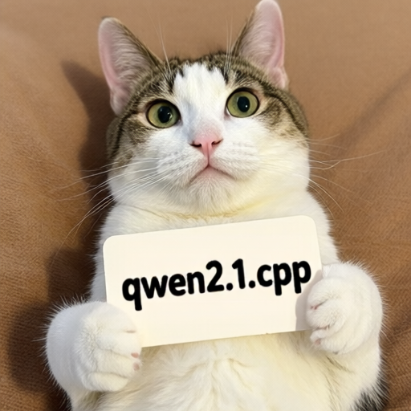

# How to Use

Qwen Image 2.1 supports text-to-image generation and image editing, using Qwen3-VL-8B as the text encoder and its own VAE.

## Download weights

- Download Qwen Image 2.1
    - safetensors: https://huggingface.co/Comfy-Org/Qwen-Image-2.1/tree/main/diffusion_models
    - gguf: https://huggingface.co/leejet/Qwen-Image-2.1-GGUF/tree/main
- Download vae
    - safetensors: https://huggingface.co/Comfy-Org/Qwen-Image-2.1/tree/main/vae
- Download Qwen3-VL-8B-Instruct
    - safetensors (BF16 or INT8 convrot): https://huggingface.co/Comfy-Org/Qwen-Image-2.1/tree/main/text_encoders
    - gguf: https://huggingface.co/Qwen/Qwen3-VL-8B-Instruct-GGUF/tree/main
    - For image editing with a GGUF text encoder, also download `mmproj-Qwen3VL-8B-Instruct-F16.gguf` from the same repository and pass it with `--llm_vision`.

Use `qwen_image_2.1_vae_bf16.safetensors` with this model. The earlier Qwen Image and Wan 2.2 VAE weights are not interchangeable with the Qwen Image 2.1 VAE weights.

## Examples

Run the following commands from the build directory. Use image dimensions divisible by 32. The resolution-dependent flow schedule is selected automatically.

### Text to image

```powershell
.\bin\Release\sd-cli.exe --diffusion-model ..\models\diffusion_models\qwen_image_2.1_int8_convrot.safetensors --vae ..\models\vae\qwen_image_2.1_vae_bf16.safetensors --llm ..\models\text_encoders\Qwen3VL-8B-Instruct-Q4_K_M.gguf -p "a lovely cat holding a sign says 'qwen2.1.cpp'" --cfg-scale 6.0 --sampling-method euler -v --offload-to-cpu -o qwen_image_2.1.png
```



To use GGUF diffusion weights, set `--diffusion-model` to the path of a file such as `qwen_image_2.1-Q4_K.gguf`.

### Image editing

Pass the reference image with `-r` and describe the edit in `-p`. Vision weights are required; the example below loads them separately with `--llm_vision`.

```powershell
.\bin\Release\sd-cli.exe --diffusion-model ..\models\diffusion_models\qwen_image_2.1_int8_convrot.safetensors --vae ..\models\vae\qwen_image_2.1_vae_bf16.safetensors --llm ..\models\text_encoders\Qwen3VL-8B-Instruct-Q4_K_M.gguf --llm_vision ..\models\text_encoders\Qwen3VL-8B-Instruct-mmproj-BF16.gguf -r ..\assets\qwen\qwen_image_2.1.png -p "change 'qwen2.1.cpp' to 'sd.cpp'" --cfg-scale 6.0 --sampling-method euler -v --offload-to-cpu -o qwen_image_2.1_edit.png
```

For multiple reference images, repeat `-r` in the desired order, for example `-r first.png -r second.png`.
