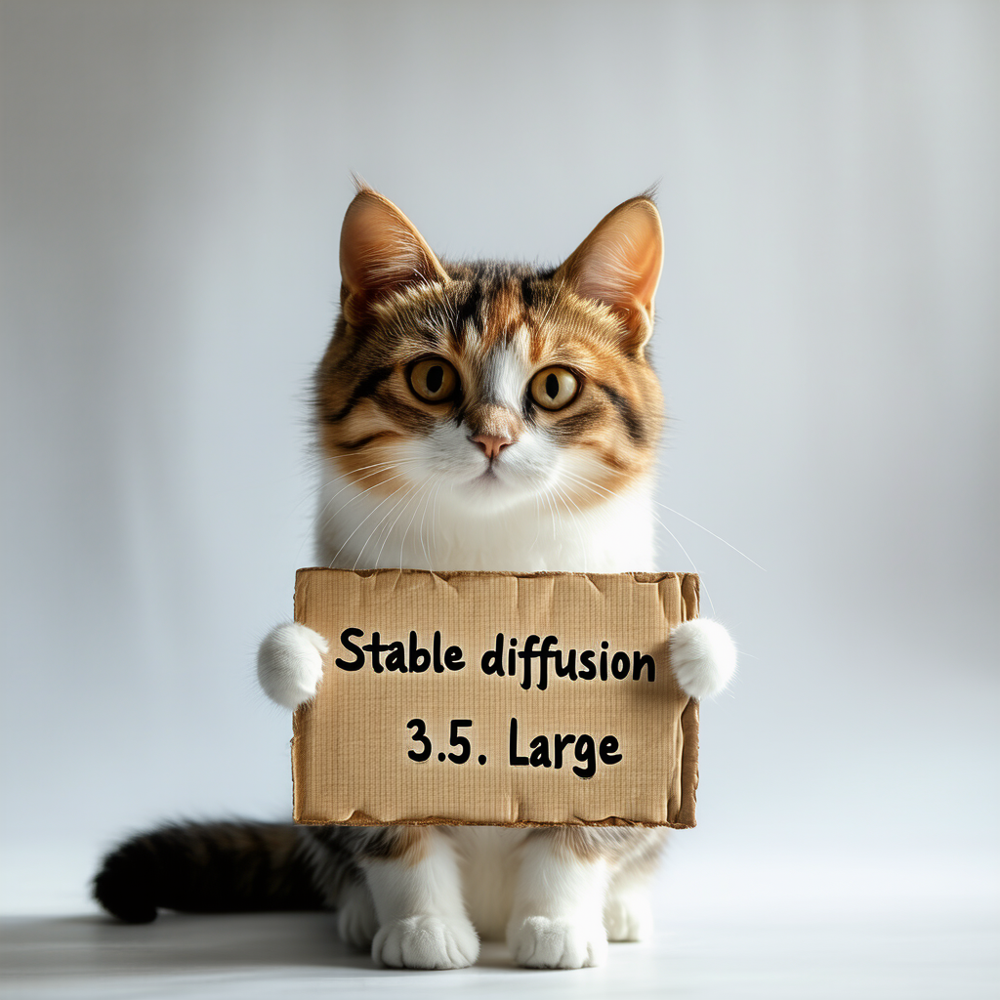

# How to Use

## Download weights

- Download sd3.5_large from https://huggingface.co/stabilityai/stable-diffusion-3.5-large/blob/main/sd3.5_large.safetensors
- Download clip_g from https://huggingface.co/Comfy-Org/stable-diffusion-3.5-fp8/blob/main/text_encoders/clip_g.safetensors
- Download clip_l from https://huggingface.co/Comfy-Org/stable-diffusion-3.5-fp8/blob/main/text_encoders/clip_l.safetensors
- Download t5xxl from https://huggingface.co/Comfy-Org/stable-diffusion-3.5-fp8/blob/main/text_encoders/t5xxl_fp16.safetensors


## Run

### SD3.5 Large
For example:

```
.\bin\Release\sd.exe -m  ..\models\sd3.5_large.safetensors --clip_l ..\models\clip_l.safetensors --clip_g ..\models\clip_g.safetensors --t5xxl ..\models\t5xxl_fp16.safetensors  -H 1024 -W 1024 -p 'a lovely cat holding a sign says \"Stable diffusion 3.5 Large\"' --cfg-scale 4.5 --sampling-method euler -v
```

