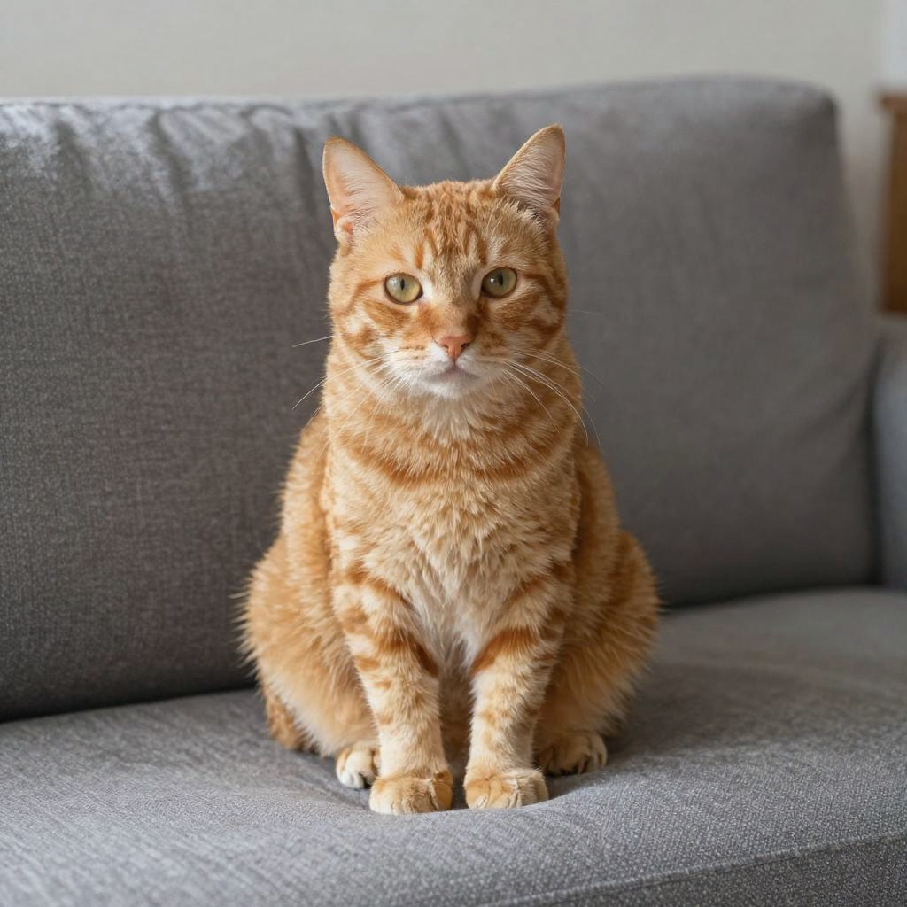

# How to Use

SeFi-Image uses a Flux2-style dual-time transformer (semantic + texture streams), the standard Flux2 VAE, and Qwen3-VL as the LLM text encoder. Tech report: [arXiv:2606.22568](https://arxiv.org/abs/2606.22568).

## Download weights

The SeFi-Image family ships in three scales (1B / 2B / 5B) and three families (Base / RL / turbo), all gated on Hugging Face under https://huggingface.co/SeFi-Image.

- 1B and 2B variants pair with Qwen3-VL-2B-Instruct.
- 5B variants pair with Qwen3-VL-4B-Instruct.
- All variants use the standard Flux2 VAE (`flux2_ae.safetensors` from https://huggingface.co/black-forest-labs/FLUX.2-dev).

Convert the transformer and text encoder to sd.cpp safetensors:

```bash
python3 scripts/convert_sefi.py     <hf_repo_dir>                          <out_dir>/sefi_<scale>_<family>.safetensors
python3 scripts/convert_qwen3_vl.py  <hf_repo_dir>/Qwen3-VL-XB-Instruct    <out_dir>/qwen3_vl_<X>b.safetensors
```

## Variant defaults

| Family | timestep_shift_alpha | steps | cfg-scale |
|---|---|---|---|
| Base | 0.3 | 50 | 4.0 |
| RL | 0.3 | 50 | 4.0 |
| turbo | 1.0 | 4 | 1.0 |

The dispatcher picks `alpha` from the filename (`turbo` substring => 1.0, otherwise 0.3). Override via `--extra-sample-args sefi_alpha=<value>` or `sefi_delta_t=<value>`.

## Examples

### 1B / 2B turbo

```
./build/bin/sd-cli --diffusion-model /path/to/sefi_1b_turbo.safetensors --vae /path/to/flux2_ae.safetensors --llm /path/to/qwen3_vl_2b.safetensors -p "a photograph of an orange tabby cat sitting on a couch" --cfg-scale 1.0 --steps 4 -W 1024 -H 1024 -s 42 --diffusion-fa --offload-to-cpu -o out.png
```

### 1B / 2B base

```
./build/bin/sd-cli --diffusion-model /path/to/sefi_1b_base.safetensors --vae /path/to/flux2_ae.safetensors --llm /path/to/qwen3_vl_2b.safetensors -p "a photograph of an orange tabby cat sitting on a couch" --cfg-scale 4.0 --steps 50 -W 1024 -H 1024 -s 42 --diffusion-fa --offload-to-cpu -o out.png
```

### 5B (needs streaming on 12 GiB VRAM)

```
./build/bin/sd-cli --diffusion-model /path/to/sefi_5b_turbo.safetensors --vae /path/to/flux2_ae.safetensors --llm /path/to/qwen3_vl_4b.safetensors -p "a photograph of an orange tabby cat sitting on a couch" --cfg-scale 1.0 --steps 4 -W 1024 -H 1024 -s 42 --diffusion-fa --max-vram 8 --stream-layers --offload-to-cpu -o out.png
```


