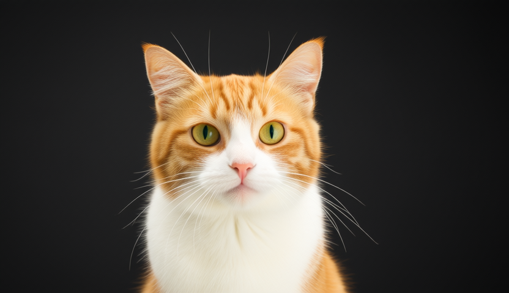

# How to Use

## Download weights

- Download Wan
    - Wan2.1
        - Wan2.1 T2V 1.3B
            - safetensors: https://huggingface.co/Comfy-Org/Wan_2.1_ComfyUI_repackaged/tree/main/split_files/diffusion_models
        - Wan2.1 T2V 14B
            - safetensors: https://huggingface.co/Comfy-Org/Wan_2.1_ComfyUI_repackaged/tree/main/split_files/diffusion_models
            - gguf: https://huggingface.co/city96/Wan2.1-T2V-14B-gguf/tree/main
        - Wan2.1 I2V 14B 480P
            - safetensors: https://huggingface.co/Comfy-Org/Wan_2.1_ComfyUI_repackaged/tree/main/split_files/diffusion_models
            - gguf: https://huggingface.co/city96/Wan2.1-I2V-14B-480P-gguf/tree/main
        - Wan2.1 I2V 14B 720P
            - safetensors: https://huggingface.co/Comfy-Org/Wan_2.1_ComfyUI_repackaged/tree/main/split_files/diffusion_models
            - gguf: https://huggingface.co/city96/Wan2.1-I2V-14B-720P-gguf/tree/main
        - Wan2.1 FLF2V 14B 720P
            - safetensors: https://huggingface.co/Comfy-Org/Wan_2.1_ComfyUI_repackaged/tree/main/split_files/diffusion_models
            - gguf: https://huggingface.co/city96/Wan2.1-FLF2V-14B-720P-gguf/tree/main
        - Wan2.1 VACE 1.3B
            - safetensors: https://huggingface.co/Comfy-Org/Wan_2.1_ComfyUI_repackaged/tree/main/split_files/diffusion_models
            - gguf: https://huggingface.co/calcuis/wan-1.3b-gguf/tree/main
        - Wan2.1 VACE 14B
            - safetensors: https://huggingface.co/Comfy-Org/Wan_2.1_ComfyUI_repackaged/tree/main/split_files/diffusion_models
            - gguf: https://huggingface.co/QuantStack/Wan2.1_14B_VACE-GGUF/tree/main
    - Wan2.2
        - Wan2.2 TI2V 5B
            - safetensors: https://huggingface.co/Comfy-Org/Wan_2.2_ComfyUI_Repackaged/tree/main/split_files/diffusion_models
            - gguf: https://huggingface.co/QuantStack/Wan2.2-TI2V-5B-GGUF/tree/main
        - Wan2.2 T2V A14B
            - safetensors: https://huggingface.co/Comfy-Org/Wan_2.2_ComfyUI_Repackaged/tree/main/split_files/diffusion_models
            - gguf: https://huggingface.co/QuantStack/Wan2.2-T2V-A14B-GGUF/tree/main
        - Wan2.2 I2V A14B
            - safetensors: https://huggingface.co/Comfy-Org/Wan_2.2_ComfyUI_Repackaged/tree/main/split_files/diffusion_models
            - gguf: https://huggingface.co/QuantStack/Wan2.2-I2V-A14B-GGUF/tree/main
- Download vae
    - wan_2.1_vae (for all the wan model except Wan2.2 TI2V 5B)
        - safetensors: https://huggingface.co/Comfy-Org/Wan_2.1_ComfyUI_repackaged/blob/main/split_files/vae/wan_2.1_vae.safetensors
    - wan_2.2_vae (for Wan2.2 TI2V 5B only)
        - safetensors: https://huggingface.co/Comfy-Org/Wan_2.2_ComfyUI_Repackaged/blob/main/split_files/vae/wan2.2_vae.safetensors

    > Wan models vae requires really much VRAM! If you do not have enough VRAM, please try tae instead, though the results may be poorer. For tae usage, please refer to [taesd](taesd.md)

- Download umt5_xxl
    - safetensors: https://huggingface.co/Comfy-Org/Wan_2.1_ComfyUI_repackaged/blob/main/split_files/text_encoders/umt5_xxl_fp16.safetensors
    - gguf: https://huggingface.co/city96/umt5-xxl-encoder-gguf/tree/main

- Download clip_vison_h (for Wan2.1 I2V/FLF2V only)
    - safetensors: https://huggingface.co/Comfy-Org/Wan_2.1_ComfyUI_repackaged/blob/main/split_files/clip_vision/clip_vision_h.safetensors


## Examples

### Wan2.1 T2V 1.3B

```
.\bin\Release\sd-cli.exe -M vid_gen --diffusion-model  ..\..\ComfyUI\models\diffusion_models\wan2.1_t2v_1.3B_fp16.safetensors --vae ..\..\ComfyUI\models\vae\wan_2.1_vae.safetensors --t5xxl ..\..\ComfyUI\models\text_encoders\umt5-xxl-encoder-Q8_0.gguf  -p "a lovely cat" --cfg-scale 6.0 --sampling-method euler -v -n "色调艳丽，过曝，静态，细节模糊不清，字幕，风格，作品，画作，画面，静止，整体发灰，最差质量，低质量，JPEG压缩残留，丑陋的，残缺的，多余的手指，画得不好的手部，画得不好的脸部， 畸形的，毁容的，形态畸形的肢体，手指融合，静止不动的画面，杂乱的背景，三条腿，背景人很多，倒着走" -W 832 -H 480 --diffusion-fa --video-frames 33 --flow-shift 3.0
```

<video src=../assets/wan/Wan2.1_1.3B_t2v.mp4 controls="controls" muted="muted" type="video/mp4"></video>

### Wan2.1 T2V 14B

```
.\bin\Release\sd-cli.exe -M vid_gen --diffusion-model  ..\..\ComfyUI\models\diffusion_models\wan2.1-t2v-14b-Q8_0.gguf --vae ..\..\ComfyUI\models\vae\wan_2.1_vae.safetensors --t5xxl ..\..\ComfyUI\models\text_encoders\umt5-xxl-encoder-Q8_0.gguf  -p "a lovely cat" --cfg-scale 6.0 --sampling-method euler -v -n "色调艳丽，过曝，静态，细节模糊不清，字幕，风格，作品，画作，画面，静止，整体发灰，最差质量，低质量，JPEG压缩残留，丑陋的，残缺的，多余的手指，画得不好的手部，画得不好的脸部，畸形的，毁容的，形态畸形的肢体，手指融合，静止不动的画面，杂乱的背景，三条腿，背景人很多，倒着走" -W 832 -H 480 --diffusion-fa  --offload-to-cpu --video-frames 33 --flow-shift 3.0
```

<video src=../assets/wan/Wan2.1_14B_t2v.mp4 controls="controls" muted="muted" type="video/mp4"></video>


### Wan2.1 I2V 14B

```
.\bin\Release\sd-cli.exe -M vid_gen --diffusion-model  ..\..\ComfyUI\models\diffusion_models\wan2.1-i2v-14b-480p-Q8_0.gguf --vae ..\..\ComfyUI\models\vae\wan_2.1_vae.safetensors --t5xxl ..\..\ComfyUI\models\text_encoders\umt5-xxl-encoder-Q8_0.gguf --clip_vision ..\..\ComfyUI\models\clip_vision\clip_vision_h.safetensors -p "a lovely cat" --cfg-scale 6.0 --sampling-method euler -v -n "色调艳丽，过曝，静态，细节模糊不清，字幕，风格，作品，画作，画面，静止，整体发灰，最差质量，低质量，JPEG压缩残留，丑陋的，残缺的，多余的手指，画得不好的手部，画得不好的脸部，畸形的，毁容的，形态畸形的肢体，手指融合，静止不动的画面，杂乱的背景，三条腿，背景人很多，倒着走" -W 480 -H 832 --diffusion-fa --video-frames 33 --offload-to-cpu -i ..\assets\cat_with_sd_cpp_42.png --flow-shift 3.0
```

<video src=../assets/wan/Wan2.1_14B_i2v.mp4 controls="controls" muted="muted" type="video/mp4"></video>

### Wan2.2 T2V A14B

```
.\bin\Release\sd-cli.exe -M vid_gen --diffusion-model  ..\..\ComfyUI\models\diffusion_models\Wan2.2-T2V-A14B-LowNoise-Q8_0.gguf --high-noise-diffusion-model  ..\..\ComfyUI\models\diffusion_models\Wan2.2-T2V-A14B-HighNoise-Q8_0.gguf --vae ..\..\ComfyUI\models\vae\wan_2.1_vae.safetensors --t5xxl ..\..\ComfyUI\models\text_encoders\umt5-xxl-encoder-Q8_0.gguf  -p "a lovely cat" --cfg-scale 3.5 --sampling-method euler --steps 10 --high-noise-cfg-scale 3.5 --high-noise-sampling-method euler --high-noise-steps 8 -v -n "色调艳丽，过曝，静态，细节模糊不清，字幕，风格，作品，画作，画面，静止，整体发灰，最差质量，低质量，JPEG压缩残留，丑陋的，残缺的，多余的手指，画得不好的手部，画得不好的脸部，畸形的，毁容的，形态畸形的肢体，手指融合，静止不动的画面，杂乱的背景，三条腿，背景人很多，倒着走" -W 832 -H 480 --diffusion-fa --offload-to-cpu --video-frames 33 --flow-shift 3.0
```

<video src=../assets/wan/Wan2.2_14B_t2v.mp4 controls="controls" muted="muted" type="video/mp4"></video>

### Wan2.2 I2V A14B

```
.\bin\Release\sd-cli.exe -M vid_gen --diffusion-model  ..\..\ComfyUI\models\diffusion_models\Wan2.2-I2V-A14B-LowNoise-Q8_0.gguf --high-noise-diffusion-model  ..\..\ComfyUI\models\diffusion_models\Wan2.2-I2V-A14B-HighNoise-Q8_0.gguf --vae ..\..\ComfyUI\models\vae\wan_2.1_vae.safetensors --t5xxl ..\..\ComfyUI\models\text_encoders\umt5-xxl-encoder-Q8_0.gguf  -p "a lovely cat" --cfg-scale 3.5 --sampling-method euler --steps 10 --high-noise-cfg-scale 3.5 --high-noise-sampling-method euler --high-noise-steps 8 -v -n "色调艳丽，过曝，静态，细节模糊不清，字幕，风格，作品，画作，画面，静止，整体发灰，最差质量，低质量，JPEG压缩残留，丑陋的，残缺的，多余的手指，画得不好的手部，画得不好的脸部，畸形的，毁容的，形态畸形的肢体，手指融合，静止不动的画面，杂乱的背景，三条腿，背景人很多，倒着走" -W 832 -H 480 --diffusion-fa --offload-to-cpu --video-frames 33 --offload-to-cpu -i ..\assets\cat_with_sd_cpp_42.png --flow-shift 3.0
```

<video src=../assets/wan/Wan2.2_14B_i2v.mp4 controls="controls" muted="muted" type="video/mp4"></video>

### Wan2.2 T2V A14B T2I

```
.\bin\Release\sd-cli.exe -M vid_gen --diffusion-model  ..\..\ComfyUI\models\diffusion_models\Wan2.2-T2V-A14B-LowNoise-Q8_0.gguf --high-noise-diffusion-model  ..\..\ComfyUI\models\diffusion_models\Wan2.2-T2V-A14B-HighNoise-Q8_0.gguf --vae ..\..\ComfyUI\models\vae\wan_2.1_vae.safetensors --t5xxl ..\..\ComfyUI\models\text_encoders\umt5-xxl-encoder-Q8_0.gguf  -p "a lovely cat" --cfg-scale 3.5 --sampling-method euler --steps 10 --high-noise-cfg-scale 3.5 --high-noise-sampling-method euler --high-noise-steps 8 -v -n "色调艳丽，过曝，静态，细节模糊不清，字幕，风格，作品，画作，画面，静止，整体发灰，最差质量，低质量，JPEG压缩残留，丑陋的，残缺的，多余的手指，画得不好的手部，画得不好的脸部，畸形的，毁容的，形态畸形的肢体，手指融合，静止不动的画面，杂乱的背景，三条腿，背景人很多，倒着走" -W 832 -H 480 --diffusion-fa --offload-to-cpu --flow-shift 3.0
```



### Wan2.2 T2V 14B with Lora

```
.\bin\Release\sd-cli.exe -M vid_gen --diffusion-model  ..\..\ComfyUI\models\diffusion_models\Wan2.2-T2V-A14B-LowNoise-Q8_0.gguf --high-noise-diffusion-model  ..\..\ComfyUI\models\diffusion_models\Wan2.2-T2V-A14B-HighNoise-Q8_0.gguf --vae ..\..\ComfyUI\models\vae\wan_2.1_vae.safetensors --t5xxl ..\..\ComfyUI\models\text_encoders\umt5-xxl-encoder-Q8_0.gguf  -p "a lovely cat<lora:wan2.2_t2v_lightx2v_4steps_lora_v1.1_low_noise:1><lora:|high_noise|wan2.2_t2v_lightx2v_4steps_lora_v1.1_high_noise:1>" --cfg-scale 3.5 --sampling-method euler --steps 4 --high-noise-cfg-scale 3.5 --high-noise-sampling-method euler --high-noise-steps 4 -v -n "色调艳丽，过曝，静态，细节模糊不清，字幕，风格，作品，画作，画面，静止，整体发灰，最差质量，低质量，JPEG压缩残留，丑陋的，残缺的，多余的手指，画得不好的手部，画得不好的脸部，畸形的，毁容的，形态畸形的肢体，手指融合，静止不动的画面，杂乱的背景，三条腿，背景人很多，倒着走" -W 832 -H 480 --diffusion-fa --offload-to-cpu --lora-model-dir ..\..\ComfyUI\models\loras --video-frames 33 --flow-shift 3.0
```

<video src=../assets/wan/Wan2.2_14B_t2v_lora.mp4 controls="controls" muted="muted" type="video/mp4"></video>


### Wan2.2 TI2V 5B

#### T2V

```
.\bin\Release\sd-cli.exe -M vid_gen --diffusion-model  ..\..\ComfyUI\models\diffusion_models\wan2.2_ti2v_5B_fp16.safetensors --vae ..\..\ComfyUI\models\vae\wan2.2_vae.safetensors --t5xxl ..\..\ComfyUI\models\text_encoders\umt5-xxl-encoder-Q8_0.gguf  -p "a lovely cat" --cfg-scale 6.0 --sampling-method euler -v -n "色调艳丽，过曝，静态，细节模糊不清，字幕，风格，作品，画作，画面，静止，整体发灰，最差质量，低质量，JPEG压缩残留，丑陋的，残缺的，多余的手指，画得不好的手部，画得不好的脸部，畸形的，毁容的，形态畸形的肢体，手指融合，静止不动的画面，杂乱的背景，三条腿，背景人很多，倒着走" -W 480 -H 832 --diffusion-fa --offload-to-cpu --video-frames 33 --flow-shift 3.0
```

<video src=../assets/wan/Wan2.2_5B_t2v.mp4 controls="controls" muted="muted" type="video/mp4"></video>

#### I2V

```
.\bin\Release\sd-cli.exe -M vid_gen --diffusion-model  ..\..\ComfyUI\models\diffusion_models\wan2.2_ti2v_5B_fp16.safetensors --vae ..\..\ComfyUI\models\vae\wan2.2_vae.safetensors --t5xxl ..\..\ComfyUI\models\text_encoders\umt5-xxl-encoder-Q8_0.gguf  -p "a lovely cat" --cfg-scale 6.0 --sampling-method euler -v -n "色调艳丽，过曝，静态，细节模糊不清，字幕，风格，作品，画作，画面，静止，整体发灰，最差质量，低质量，JPEG压缩残留，丑陋的，残缺的，多余的手指，画得不好的手部，画得不好的脸部，畸形的，毁容的，形态畸形的肢体，手指融合，静止不动的画面，杂乱的背景，三条腿，背景人很多，倒着走" -W 480 -H 832 --diffusion-fa --offload-to-cpu --video-frames 33 -i ..\assets\cat_with_sd_cpp_42.png --flow-shift 3.0
```

<video src=../assets/wan/Wan2.2_5B_i2v.mp4 controls="controls" muted="muted" type="video/mp4"></video>

### Wan2.1 FLF2V 14B

```
.\bin\Release\sd-cli.exe -M vid_gen --diffusion-model  ..\..\ComfyUI\models\diffusion_models\wan2.1-flf2v-14b-720p-Q8_0.gguf --vae ..\..\ComfyUI\models\vae\wan_2.1_vae.safetensors --t5xxl ..\..\ComfyUI\models\text_encoders\umt5-xxl-encoder-Q8_0.gguf --clip_vision ..\..\ComfyUI\models\clip_vision\clip_vision_h.safetensors -p "glass flower blossom" --cfg-scale 6.0 --sampling-method euler -v -n "色调艳丽，过曝，静态，细节模糊不清，字幕，风格，作品，画作，画面，静止，整体发灰，最差质量，低质量，JPEG压缩残留，丑陋的，残缺的，多余的手指，画得不好的手部，画得不好的脸部，畸形的，毁容的，形态畸形的肢体，手指融合，静止不动的画面，杂乱的背景，三条腿，背景人很多，倒着走" -W 480 -H 832 --diffusion-fa --video-frames 33 --offload-to-cpu --init-img ..\..\ComfyUI\input\start_image.png --end-img ..\..\ComfyUI\input\end_image.png --flow-shift 3.0
```


<video src=../assets/wan/Wan2.1_14B_flf2v.mp4 controls="controls" muted="muted" type="video/mp4"></video>

### Wan2.2 FLF2V 14B

```
.\bin\Release\sd-cli.exe -M vid_gen --diffusion-model  ..\..\ComfyUI\models\diffusion_models\Wan2.2-I2V-A14B-LowNoise-Q8_0.gguf --high-noise-diffusion-model  ..\..\ComfyUI\models\diffusion_models\Wan2.2-I2V-A14B-HighNoise-Q8_0.gguf --vae ..\..\ComfyUI\models\vae\wan_2.1_vae.safetensors --t5xxl ..\..\ComfyUI\models\text_encoders\umt5-xxl-encoder-Q8_0.gguf --cfg-scale 3.5 --sampling-method euler --steps 10 --high-noise-cfg-scale 3.5 --high-noise-sampling-method euler --high-noise-steps 8 -v -p "glass flower blossom" -n "色调艳丽，过曝，静态，细节模糊不清，字幕，风格，作品，画作，画面，静止，整体发灰，最差质量，低质量，JPEG压缩残留，丑陋的，残缺的，多余的手指，画得不好的手部，画得不好的脸部，畸形的，毁容的，形态畸形的肢体，手指融合，静止不动的画面，杂乱的背景，三条腿，背景人很多，倒着走" -W 480 -H 832 --diffusion-fa --video-frames 33 --offload-to-cpu --init-img ..\..\ComfyUI\input\start_image.png --end-img ..\..\ComfyUI\input\end_image.png --flow-shift 3.0
```

<video src=../assets/wan/Wan2.2_14B_flf2v.mp4 controls="controls" muted="muted" type="video/mp4"></video>

### Wan2.1 VACE 1.3B

#### T2V

```
.\bin\Release\sd-cli.exe -M vid_gen --diffusion-model  ..\..\ComfyUI\models\diffusion_models\wan2.1-vace-1.3b-q8_0.gguf --vae ..\..\ComfyUI\models\vae\wan_2.1_vae.safetensors --t5xxl ..\..\ComfyUI\models\text_encoders\umt5-xxl-encoder-Q8_0.gguf  -p "a lovely cat" --cfg-scale 6.0 --sampling-method euler -v -n "色调艳丽，过曝，静态，细节模糊不清，字幕，风格，作品，画作，画面，静止，整体发灰，最差质量，低质量，JPEG压缩残留，丑陋的，残缺的，多余的手指，画得不好的手部，画得不好的脸部， 畸形的，毁容的，形态畸形的肢体，手指融合，静止不动的画面，杂乱的背景，三条腿，背景人很多，倒着走" -W 832 -H 480 --diffusion-fa --video-frames 1 --offload-to-cpu
```

<video src=../assets/wan/Wan2.1_1.3B_vace_t2v.mp4 controls="controls" muted="muted" type="video/mp4"></video>


#### R2V

```
.\bin\Release\sd-cli.exe -M vid_gen --diffusion-model  ..\..\ComfyUI\models\diffusion_models\wan2.1-vace-1.3b-q8_0.gguf --vae ..\..\ComfyUI\models\vae\wan_2.1_vae.safetensors --t5xxl ..\..\ComfyUI\models\text_encoders\umt5-xxl-encoder-Q8_0.gguf  -p "a lovely cat" --cfg-scale 6.0 --sampling-method euler -v -n "色调艳丽，过曝，静态，细节模糊不清，字幕，风格，作品，画作，画面，静止，整体发灰，最差质量，低质量，JPEG压缩残留，丑陋的，残缺的，多余的手指，画得不好的手部，画得不好的脸部， 畸形的，毁容的，形态畸形的肢体，手指融合，静止不动的画面，杂乱的背景，三条腿，背景人很多，倒着走" -W 832 -H 480 --diffusion-fa -i ..\assets\cat_with_sd_cpp_42.png --video-frames 33 --offload-to-cpu
```

<video src=../assets/wan/Wan2.1_1.3B_vace_r2v.mp4 controls="controls" muted="muted" type="video/mp4"></video>


#### V2V

```
mkdir post+depth
ffmpeg -i ..\..\ComfyUI\input\post+depth.mp4 -qscale:v 1 -vf fps=8 post+depth\frame_%04d.jpg
.\bin\Release\sd-cli.exe -M vid_gen --diffusion-model  ..\..\ComfyUI\models\diffusion_models\wan2.1-vace-1.3b-q8_0.gguf --vae ..\..\ComfyUI\models\vae\wan_2.1_vae.safetensors --t5xxl ..\..\ComfyUI\models\text_encoders\umt5-xxl-encoder-Q8_0.gguf  -p "The girl is dancing in a sea of flowers, slowly moving her hands. There is a close - up shot of her upper body. The character is surrounded by other transparent glass flowers in the style of Nicoletta Ceccoli, creating a beautiful, surreal, and emotionally expressive movie scene with a white. transparent feel and a dreamyl atmosphere." --cfg-scale 6.0 --sampling-method euler -v -n "色调艳丽，过曝，静态，细节模糊不清，字幕，风格，作品，画作，画面，静止，整体发灰，最差质量，低质量，JPEG压缩残留，丑陋的，残缺的，多余的手指，画得不好的手部，画得不好的脸部， 畸形的，毁容的，形态畸形的肢体，手指融合，静止不动的画面，杂乱的背景，三条腿，背景人很多，倒着走" -W 480 -H 832 --diffusion-fa -i ..\..\ComfyUI\input\dance_girl.jpg --control-video ./post+depth --video-frames 33 --offload-to-cpu
```

<video src=../assets/wan/Wan2.1_1.3B_vace_v2v.mp4 controls="controls" muted="muted" type="video/mp4"></video>

### Wan2.1 VACE 14B

#### T2V

```
.\bin\Release\sd-cli.exe -M vid_gen --diffusion-model  ..\..\ComfyUI\models\diffusion_models\Wan2.1_14B_VACE-Q8_0.gguf --vae ..\..\ComfyUI\models\vae\wan_2.1_vae.safetensors --t5xxl ..\..\ComfyUI\models\text_encoders\umt5-xxl-encoder-Q8_0.gguf  -p "a lovely cat" --cfg-scale 6.0 --sampling-method euler -v -n "色调艳丽，过曝，静态，细节模糊不清，字幕，风格，作品，画作，画面，静止，整体发灰，最差质量，低质量，JPEG压缩残留，丑陋的，残缺的，多余的手指，画得不好的手部，画得不好的脸部， 畸形的，毁容的，形态畸形的肢体，手指融合，静止不动的画面，杂乱的背景，三条腿，背景人很多，倒着走" -W 832 -H 480 --diffusion-fa --video-frames 33 --offload-to-cpu
```

<video src=../assets/wan/Wan2.1_14B_vace_t2v.mp4 controls="controls" muted="muted" type="video/mp4"></video>


#### R2V

```
.\bin\Release\sd-cli.exe -M vid_gen --diffusion-model  ..\..\ComfyUI\models\diffusion_models\Wan2.1_14B_VACE-Q8_0.gguf --vae ..\..\ComfyUI\models\vae\wan_2.1_vae.safetensors --t5xxl ..\..\ComfyUI\models\text_encoders\umt5-xxl-encoder-Q8_0.gguf  -p "a lovely cat" --cfg-scale 6.0 --sampling-method euler -v -n "色调艳丽，过曝，静态，细节模糊不清，字幕，风格，作品，画作，画面，静止，整体发灰，最差质量，低质量，JPEG压缩残留，丑陋的，残缺的，多余的手指，画得不好的手部，画得不好的脸部， 畸形的，毁容的，形态畸形的肢体，手指融合，静止不动的画面，杂乱的背景，三条腿，背景人很多，倒着走" -W 832 -H 480 --diffusion-fa -i ..\assets\cat_with_sd_cpp_42.png --video-frames 33 --offload-to-cpu
```

<video src=../assets/wan/Wan2.1_14B_vace_r2v.mp4 controls="controls" muted="muted" type="video/mp4"></video>


#### V2V

```
.\bin\Release\sd-cli.exe -M vid_gen --diffusion-model  ..\..\ComfyUI\models\diffusion_models\Wan2.1_14B_VACE-Q8_0.gguf --vae ..\..\ComfyUI\models\vae\wan_2.1_vae.safetensors --t5xxl ..\..\ComfyUI\models\text_encoders\umt5-xxl-encoder-Q8_0.gguf  -p "The girl is dancing in a sea of flowers, slowly moving her hands. There is a close - up shot of her upper body. The character is surrounded by other transparent glass flowers in the style of Nicoletta Ceccoli, creating a beautiful, surreal, and emotionally expressive movie scene with a white. transparent feel and a dreamyl atmosphere." --cfg-scale 6.0 --sampling-method euler -v -n "色调艳丽，过曝，静态，细节模糊不清，字幕，风格，作品，画作，画面，静止，整体发灰，最差质量，低质量，JPEG压缩残留，丑陋的，残缺的，多余的手指，画得不好的手部，画得不好的脸部， 畸形的，毁容的，形态畸形的肢体，手指融合，静止不动的画面，杂乱的背景，三条腿，背景人很多，倒着走" -W 480 -H 832 --diffusion-fa -i ..\..\ComfyUI\input\dance_girl.jpg --control-video ./post+depth --video-frames 33 --offload-to-cpu
```

<video src=../assets/wan/Wan2.1_14B_vace_v2v.mp4 controls="controls" muted="muted" type="video/mp4"></video>
